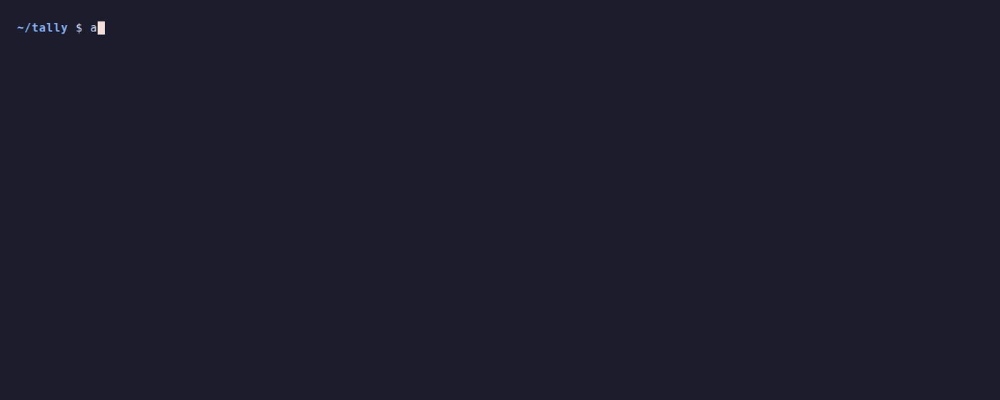

# agent

Run many coding agents at once from one small daemon. Each agent is a named
**bot** with a durable conversation: continue it later, fork it from any
earlier point, steer it mid-turn, or follow it live as a stream of JSON
events. Bots delegate by running the same `agent` command you do.

Agent is built for programs first. A script, a CI job, an app, or another bot
drives it through a CLI whose default output is JSON Lines, or through the
daemon's socket protocol. `--pretty` gives people a readable view of the same
events.

```sh
agent run --pretty --new --bot lead -- "Fix the failing test, and have a helper check the README"
```

<p align="center">
  
</p>

<p align="center"><sub><code>lead</code> hands the README check to a second bot, runs the tests, collects the helper's answer, then fixes the bug.
The model's words are scripted for this recording; the daemon, the bots, and every tool call are real.
<a href="docs/demo/">Record it yourself</a>.</sub></p>

## Install

Agent runs on macOS and Linux. Build it from source with
[Rust](https://rustup.rs); rustup fetches the toolchain pinned in
[rust-toolchain.toml](rust-toolchain.toml).

```sh
git clone https://github.com/lydakis/agent
cd agent
cargo install --locked --path .
```

That puts `agent` in `~/.cargo/bin`. The desktop app has its own build; see
[Desktop app](#desktop-app).

## Quickstart

Set the key for any provider you use, and pick a default model as
`PROVIDER/MODEL`:

```sh
export OPENAI_API_KEY=...       # models named openai/MODEL
export ANTHROPIC_API_KEY=...    # anthropic/MODEL
export OPENROUTER_API_KEY=...   # openrouter/VENDOR/MODEL
export AGENT_MODEL=anthropic/claude-opus-5-5
```

For Amazon Bedrock, set `AWS_REGION` and use your usual AWS credentials
(`AWS_PROFILE`, SSO, or keys in the environment); start the daemon with
`--provider bedrock` and name models like `bedrock/anthropic.claude-opus-5-5`,
or `--provider bedrock-openai` for `bedrock-openai/openai.gpt-6-sol`.
`AGENT_PROVIDER` takes the place of `--provider` for any provider, so
`export AGENT_PROVIDER=bedrock AGENT_MODEL=bedrock/anthropic.claude-sonnet-5`
needs no flags.

Each bot keeps the model it was created with, so bots on different providers
can run side by side in one daemon. Other OpenAI Responses-compatible gateways
can be added with `--provider`; see [providers and models](docs/RUST_PROTOTYPE.md#providers-and-models).

From your project directory, start a bot:

```sh
agent run --pretty --new --bot scout -- "What does this repository do?"
```

The first command starts the daemon in the background. Bots and their history
live in `~/.agent/state.sqlite`, so they survive restarts of the daemon and of
your machine. Leave out `--pretty` to get the raw event stream.

### Continue a bot

Name the bot again to give it its next turn in the same conversation:

```sh
agent run --pretty --bot scout -- "Which parts are tested?"
```

A bot keeps its model, instructions, and tools for life. `--model` on a later
turn overrides the model for that turn only.

### Leave it running and come back

Press **Ctrl-C** at any time; the turn keeps running in the daemon. Reattach
to replay what you missed and follow it to the end:

```sh
agent follow --pretty --bot scout
```

To start without waiting, use `--detach`. It prints a JSON handle that a script
can wait on:

```sh
handle=$(agent run --detach --bot scout -- "Run the test suite and summarize the failures" | jq -r .handle)
agent wait "$handle"
```

`agent ls --pretty` lists every bot and what it's doing. `agent follow --all`
streams events from all of them.

### Steer or stop a running bot

Send more instructions into the turn that's already running:

```sh
agent run --bot scout --delivery steer -- "Skip the integration tests"
```

Or stop it: `agent interrupt --bot scout`. A busy bot rejects new work unless
you choose `--delivery queue` or `steer`.

## Let bots delegate

Bots delegate the way the demo shows: from their shell tool they run
`agent run --detach --new --bot NAME -- TASK`, keep working, and collect the
result with their `wait` tool. The default instructions teach them this. Every
bot is a peer with the same commands; a bot that starts another doesn't own it,
and you can talk to either one directly.

A waiting bot holds no execution capacity: while it waits, it costs a row in
the store and an entry in the daemon's registry, not a process.

To give a bot your project's conventions, add `--agents` when you create it.
Agent then composes its instructions from every `AGENTS.md` from the workspace
up to the filesystem root, plus `~/.agent/AGENTS.md`, and an index of skills
in `.agent/skills/`. See [client policy](docs/CLIENT.md).

## Fork from an earlier point

Try an alternative without losing the original conversation:

```sh
agent fork --source scout --bot scout-b
agent run --pretty --bot scout-b -- "Try it with a streaming parser instead"
```

Without `--checkpoint`, the fork starts from the source's latest state. To
branch from an earlier turn, pass the `checkpoint` that
`agent result --bot scout --turn N` reports for it. Each branch continues
independently.

## Use it from a program

Output is JSON by default: `run` and `follow` stream one event per line (text,
thinking, tool calls and results, usage, state changes), and the other commands
print one JSON value or nothing. Exit codes are stable: 0 success, 1 failed or
incomplete, 2 invalid usage, and 75 when `agent serve` finds another daemon
already owns the store. The [CLI contract](docs/CLI.md) has the details.

Programs that want a persistent connection can speak the daemon's JSONL socket
protocol directly; [`client/`](client) is a Rust client for it. See the
[software protocol](docs/RUST_PROTOTYPE.md#software-protocol).

## Desktop app

[`app/`](app) is a Tauri desktop client over the same socket: bots, their
peers, and background commands in one window. See [desktop client](docs/APP.md)
to build and run it.

## How fast is it?

Performance is the point of the project, and every claim links to its
measurement. [Current evidence](docs/EVIDENCE.md) is the up-to-date summary:
runtime efficiency, task results against Codex and Claude Code, and
operational behavior. In the September 15–16 fleet checks, one daemon ran 1,024
overlapping bot turns on real providers, held 64 for five minutes without
drift, and pushed 10,000 bots through one API key at the provider's own rate
with no failures
([live fleet check](docs/LIVE_FLEET.md)). Overlap includes queued work, not
necessarily simultaneous provider streams. Those were short-context turns: they
show a lightweight runtime, not coding-agent capacity at that scale.

The same synthetic conversation work through five harnesses, 32 agents at once,
each doing three turns that add 64 KiB of text and stream back 5 KiB
([full screen](docs/HARNESS_MEASUREMENTS.md), 2026-09-23, 4-vCPU Linux VM,
medians of three runs; Agent source `8ebbc44`). That build predates group
commit and the macOS full flush, and the screen has not been rerun since;
[current evidence](docs/EVIDENCE.md#runtime-efficiency) has the newer
fixed-work measurements.

| Harness | Peak memory | CPU time | Turn p99 |
| --- | ---: | ---: | ---: |
| Agent | 22 MiB | 0.6 s | 0.62 s |
| Pi 0.85.1 | 164 MiB | 1.3 s | 0.70 s |
| Codex 0.153.1 | 244 MiB | 24.9 s | 5.9 s* |
| opencode 1.18.32 | 927 MiB | 14.4 s | 3.3 s |
| Claude Code 2.1.267 | 6,494 MiB | 23.8 s | 1.8 s |

Read this as an exploratory screen, not a ranking. The harnesses do different
amounts of work: Agent commits every turn to SQLite, opencode keeps its own
store, and the others hold conversations in memory; no tools were called.
Claude Code runs one process per agent, and its memory is summed across those
processes. Turn time includes 0.5 s of scripted streaming.
\* Codex reached only 10 to 18 of the 32 concurrent streams on this machine.

The [performance tools](docs/BENCHMARKS.md) reproduce these runs against the
same synthetic provider, and [docs/](docs) holds the design record and
measurements behind every decision.

## Status

Agent is an experiment with no users yet. It supports the OpenAI Responses and
Anthropic Messages APIs, with streamed thinking, usage, and prompt-cache
accounting; long conversations are compacted while the full history is kept.
MCP and handing a conversation across providers are not implemented.
Protocols, CLI defaults, and the store format may change between revisions;
stores migrate forward automatically.

Agent runs bots; it doesn't create workspaces, manage Git branches, or choose
machines. Those stay with the caller. To run work on another machine, see
[Errand](https://github.com/lydakis/errand).

Bots run their tools with your permissions, directly on your machine. Agent
provides no sandbox; run it inside one if you need isolation.

## When you need more

- **Every command and flag:** `agent --help`, `agent COMMAND --help`, or the
  [CLI contract](docs/CLI.md).
- **How the daemon works:** limits, storage, recovery, pacing, and compaction
  in the [runtime reference](docs/RUST_PROTOTYPE.md).
- **Why it's built this way:** the [design brief](docs/DESIGN.md) and the
  [runtime investigation](docs/RUNTIMES.md).
- **Very long conversations:** [long histories](docs/LONG_HISTORY.md) and
  [storage growth](docs/STORAGE_GROWTH.md).
- **What's next:** the [roadmap](docs/NEXT.md).

## License

Licensed under either of [Apache License 2.0](LICENSE-APACHE) or
[MIT license](LICENSE-MIT), at your option.

Unless you explicitly state otherwise, any contribution you intentionally
submit for inclusion in this project, as defined in the Apache-2.0 license,
shall be dual licensed as above, without any additional terms or conditions.
