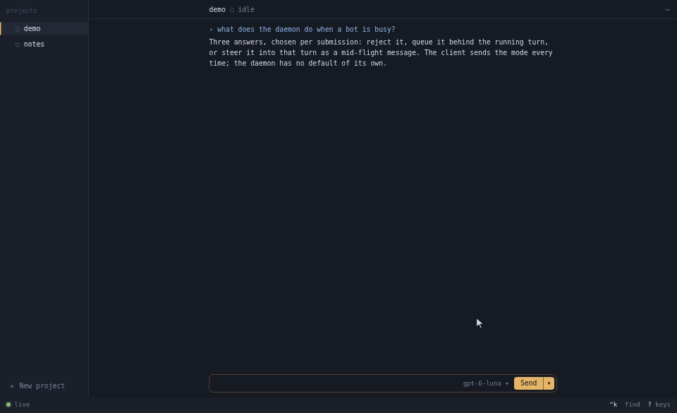
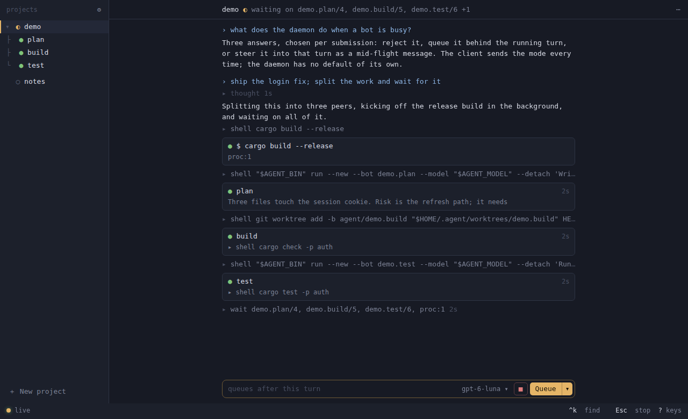
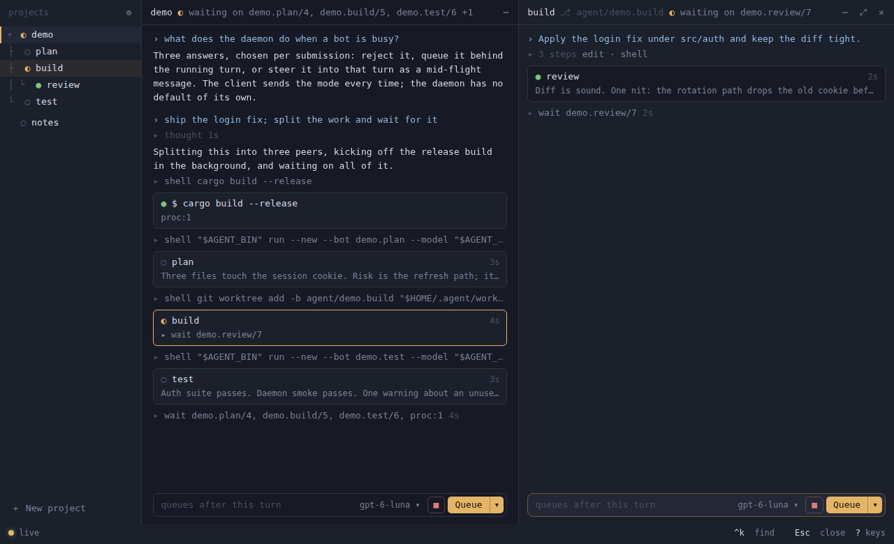
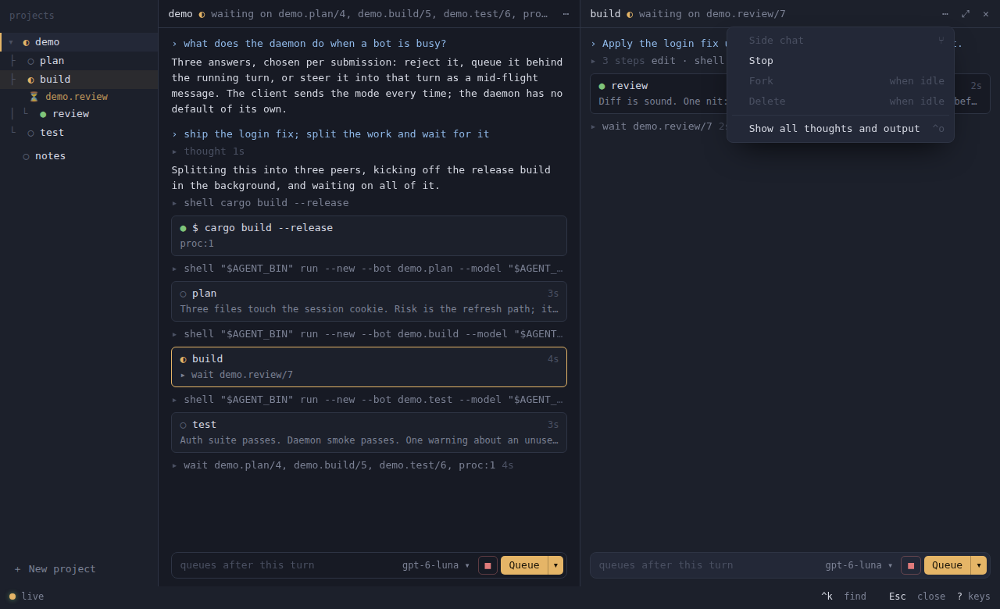
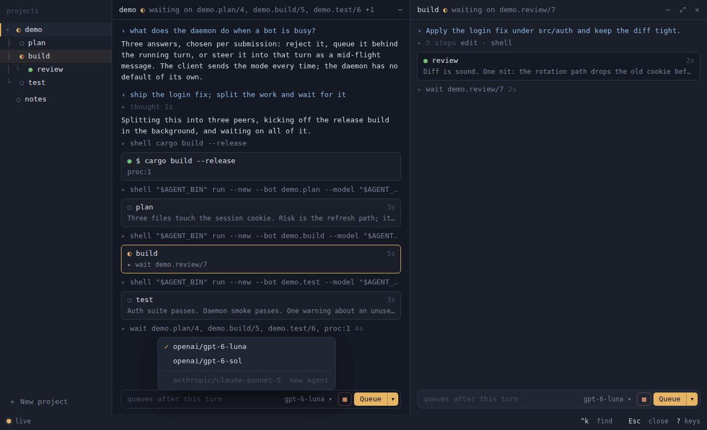
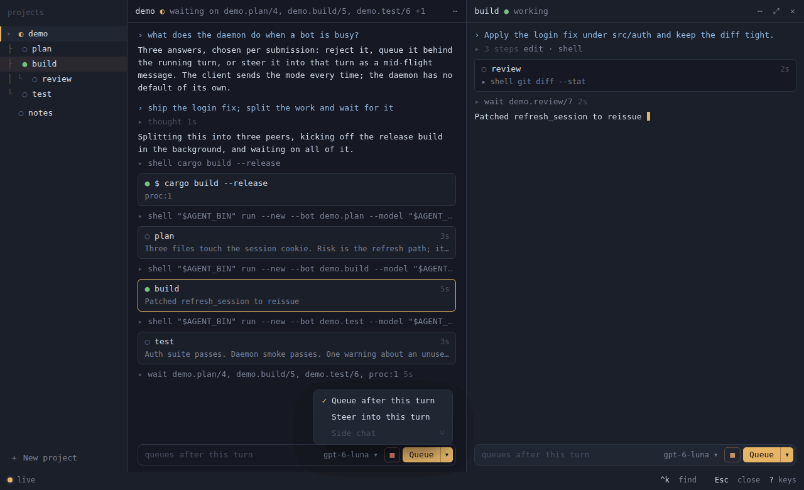
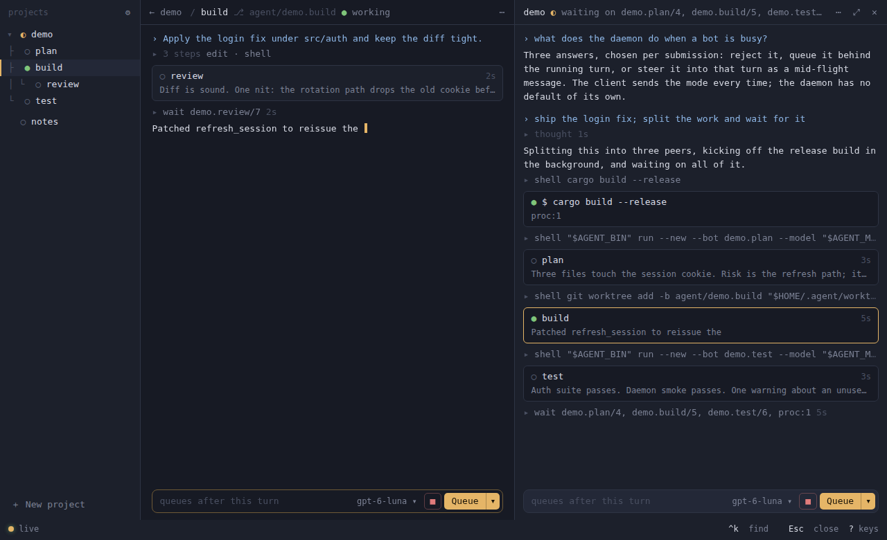
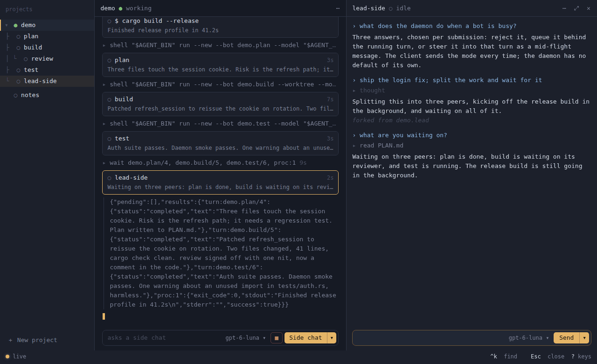
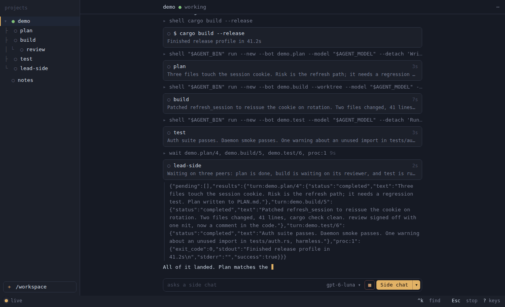

# Desktop client

`agent-app` is the Thread design as a window: the prototype's page, rendered by
the system webview, with a Rust core that speaks the daemon's socket protocol.
It exists because the design as drawn needs pixels, and a terminal's cell grid
cannot give it rounded cards, sub-cell spacing, or shadows. The daemon exposes
bounded history reads and creator identities; it does not
need to know which client is attached.

Started 2026-09-19. A terminal client (`agent-tui`, ratatui) came first the
same day and reached the limit of its grid; it was removed once the app
covered it, so one state model exists, not two.

## Screenshots

Demo mode in headless Chromium, 1280×780, captured 2026-09-27. The data is
the synthetic `demo` project.

The lead splits the work, build opens beside it, then build's ⋯ menu.



The lead waits on its tasks; each task is a card.



A task opened beside the lead, with its own composer.



One menu per agent: side chat, stop, fork, delete, show all.



The model chip: models of the bot's family; others need a new agent.



Send on a busy agent: queue after this turn, steer into it, or ask a side
chat.



build works in its own worktree: its branch follows its name in the head.



A side chat asked while the lead works: a fork beside it, the lead untouched.



New project takes a folder.



## What the daemon speaks, and why the client speaks it directly

The daemon's contract is JSONL over a Unix socket: requests with an `id`,
responses with the same `id`, and notifications without one, replayed and
then live under a store-wide cursor ([protocol](RUST_PROTOTYPE.md#software-protocol)).
The app, the `agent` CLI, and a fleet controller are the same kind of client.
Two alternatives were considered for the client path and rejected for now:

- **ACP between a client and the daemon.** ACP models one editor talking to one
  agent process over stdio. It has no vocabulary for named durable bots shared
  across clients, a store-wide event cursor, forks from history nodes, wait
  handles, delivery modes, or daemon stats; all of that would ride in extension
  fields. ACP remains the right shape for an editor adapter, as a bridge
  process that is a consumer like this app. It is not built.
- **A binary framing.** Per-event cost on the client path is the storage commit
  and the provider stream, not JSON encoding, and the socket carries no TLS or
  HTTP. A different framing would be a drop-in change behind the same op set
  if a measurement ever shows encoding on the follower path as a cost. None
  does; the JSON line protocol stays.

Remote use needs no transport work either: the protocol assumes nothing about
the stream, so `ssh -L` forwarding of the daemon's socket to a local one runs
the app locally at full speed against a daemon elsewhere. The client is built
to tolerate that latency anyway: one `follow *`, item loads pipelined per bot,
nothing polled.

## Shape

```
app/
  src-tauri/     Rust core: a transport, plus the project file
  ui/            the page: index.html, app.css, app.js, daemon.js
  playground.py  an offline daemon with a synthetic model, for mechanics
client/          agent-client: the socket protocol and the client policy
```

- **Rust core** ([app/src-tauri/src/main.rs](../app/src-tauri/src/main.rs)) is a
  transport. `setup` returns the socket, model and workspace defaults;
  `policy` composes the client policy for the workspace; `attach` connects
  and follows `*` from the page's cursor; `pull` hands the page the next
  batch of that session's notifications, at most 256, when it asks;
  `request` relays any protocol op; `models` reads `~/.agent/models`, and
  `project` and `write_project` read and write a folder's
  `.agent/project.toml` ([project.rs](../app/src-tauri/src/project.rs)).
  When nothing listens on a store's socket, `attach` starts a daemon first
  ([daemon.rs](../app/src-tauri/src/daemon.rs)); see
  [Installing](#installing).
  State and protocol logic live in the
  page, exactly as they did in the prototype, so the design and the
  mechanics iterate in one place.
- **The page** is the prototype's HTML and CSS with the fake daemon swapped
  for events: bots and transcripts built from events, lineage from the
  daemon's `created_by`, cards for peers and background commands, thoughts
  folded to their duration, lazy item loads for whatever is on screen. Events,
  snapshot reconciliation, creation replies, and history loads share one
  mutation queue, so a pending read cannot splice over a newer snapshot.
- **Demo mode.** In a plain browser there is no Rust core, so `daemon.js`
  becomes a simulated daemon that emits the same protocol shapes and answers
  `history_items`, `submit`, `create`, `fork`, `delete`, `interrupt`. A steer joins
  the running turn at its next round boundary as a user message, and the
  scripted reply acknowledges it. The scenario
  plays on load in two projects: `demo.lead` thinks, starts a release build
  in the background, spawns its tasks plan, build and test, build spawns
  review, and the coordinator waits on all of it. Serve `app/ui` with any
  static server to work on the design without a daemon.

## Installing

The app is published as a Homebrew cask for macOS (Apple silicon and Intel):

```sh
brew install --cask lydakis/agent/agent
```

The bundle carries the `agent` runtime as `Agent.app/Contents/MacOS/agent`;
the cask does not put it on `PATH`. When the app finds no daemon on its
store's socket, it runs that binary as `agent start --store STORE`, which
starts the daemon exactly as a CLI command would: providers from
`AGENT_PROVIDER` or the keys that are set, the log beside the store, a
process that outlives the window. A window opened from the Dock inherits
launchd's environment rather than a terminal's, so `agent start` runs with
the environment of the user's login shell (`$SHELL -l -i`), plus
`~/.agent/env` for keys kept out of shell profiles: `KEY=VALUE` lines
(`export` and quotes allowed, `#` comments), refused unless it is a regular
file of at most 64 KiB that only its owner can read. That file is the app's; the CLI and the daemon never read it.
The login shell is read once per app run, and without `--model` or
`AGENT_MODEL` of its own the app takes its default model from the file, then
the shell; the shell's is looked up beside the attach, so a slow profile never
delays it. The
store and socket themselves are resolved from the app's own arguments and
environment. A failed start shows the CLI's
reason on the page and is not retried for 30 seconds. An explicit `--socket`
or `AGENT_SOCKET` never starts anything. Uninstalling or upgrading the cask
quits the app and runs the bundled `agent shutdown --store
~/.agent/state.sqlite --grace 30`, so the default store's daemon, whoever
started it, lets running turns finish and exits before its binary is replaced.
The store is named so the uninstalling shell's `AGENT_STORE` or `AGENT_SOCKET`
cannot point the shutdown elsewhere. A default model that appears only after
launch, from a repaired `~/.agent/env`, is picked up on the next attach.

Releases follow Errand's: pushing a `vX.Y.Z` tag on `main` whose version both
`Cargo.toml` and `app/src-tauri/Cargo.toml` carry runs
[release.yml](../.github/workflows/release.yml) on a macOS runner. The tag
itself only starts [release-request.yml](../.github/workflows/release-request.yml),
which holds no secrets; release.yml and publish-homebrew.yml run after it from
`main`'s own definitions, so code at a tag never sees the signing secrets or
the tap token. A failed run is re-run from its own page. It runs
the tests, installs the Tauri CLI from
[app/release/package-lock.json](../app/release/package-lock.json) before any
signing material exists, builds a universal `agent` and app, and has Tauri sign both with
the Developer ID and hardened runtime, notarize and staple the bundle
([tauri.release.conf.json](../app/src-tauri/tauri.release.conf.json)); it
then verifies the signature, Gatekeeper assessment, staple, architectures and
versions, and leaves `Agent_X.Y.Z_universal.zip`, the generated cask,
`source-commit.txt` (the commit it built) and `checksums.txt` on a draft
release. Publishing the draft (not a prerelease) runs
[publish-homebrew.yml](../.github/workflows/publish-homebrew.yml): it
resolves the tag to a commit on `main` before running any of its code,
refuses assets built from any other commit (a draft's tag can move) or
lacking release.yml's build attestation (a draft's assets can be replaced),
checks them against their checksums and the tag's cask generator,
installs and audits the cask, and writes `Casks/agent.rb` to
[lydakis/homebrew-agent](https://github.com/lydakis/homebrew-agent). It never
downgrades the tap or replaces a different cask of the same version. The
helpers and their tests are in [app/release](../app/release)
(`python3 -m unittest discover -s app/release`).

Secrets: the six Apple signing and notary secrets Errand uses
(`APPLE_DEVELOPER_ID_CERTIFICATE_P12_BASE64`,
`APPLE_DEVELOPER_ID_CERTIFICATE_PASSWORD`, `APPLE_DEVELOPER_ID_APPLICATION`,
`APP_STORE_CONNECT_API_KEY_P8`, `APP_STORE_CONNECT_KEY_ID`,
`APP_STORE_CONNECT_ISSUER_ID`), and `HOMEBREW_TAP_GITHUB_TOKEN` with Contents
write access to the tap.

## Running it

```sh
cargo build --release -p agent-app
AGENT_MODEL=anthropic/claude-sonnet-5 .local/target/release/agent-app \
  --socket ~/.agent/state.sqlite.sock --workspace "$PWD"
```

Without `--workspace` the workspace is the launching directory, or home when
that is `/`, as for a window opened from the Dock. Arguments and environment
are the CLI's: `--socket`, `--store`, `--model`,
`--workspace`, `AGENT_SOCKET`, `AGENT_STORE`, `AGENT_MODEL`, and a store's
socket is resolved the way the CLI and the daemon resolve it (the shared
client crate's rendezvous), so a deep store path meets the same short socket.
The page draws with the machine's own monospace face and fetches nothing.
Closing the window is detaching; the daemon and its bots continue. The page
remembers the thread on screen, the one beside it, the sidebar, folded
projects, model picks and the steps fold per socket and workspace in the
webview's local storage, and restores them on the next start. Send's queue or
steer pick is remembered for every window. If the daemon is unreachable or closes the session, the page shows why
and retries every two seconds. Only one attachment runs at a time, including
the snapshot pages. A connected peer must send its ready line within five seconds.

Keys: `^k` find a bot, `^b` sidebar, `^p` next task beside, `^o` every
run's thoughts and output, `Esc` close the side pane then stop, `↑` `↓` on an
empty message to move between bots, `^d` close the window, Enter to send and
Shift-Enter for a new line, `/new NAME [PROVIDER/MODEL]` to create a bot, `?`
on an empty message for the list and the models in `~/.agent/models`, read
each time. `⌘` works where `^` does.

## Projects and panes

The shell follows the "Agent App Concepts" prototype (NEXT item 47). The
daemon learns nothing about projects; everything here is client work.

- **Projects.** A project is a folder, its coordinator bot `<project>.lead`,
  and `.agent/project.toml` (name, coordinator, model; mechanics only). The
  sidebar lists every coordinator in the store as a project, with its tasks
  under it: the coordinator's `created_by` lineage, plus any root bot named
  `<project>.<task>`. Bots in no project follow. A project row opens its
  coordinator; its chevron folds the tasks. **＋ New project** takes a
  folder, reads its `project.toml` (unknown keys are refused) or names the
  project after the folder, creates the coordinator there with the folder's
  own client policy, and then writes the file if there was none, so a model
  the daemon refuses is never saved. The file goes in through a temporary
  and a link, so it is never partial and never replaces one. An existing
  coordinator is opened if it works in that folder (and the file it lacks is
  written with its model); one in another folder is a name collision,
  reported and not opened.
- **Panes.** A sidebar row opens that thread alone. A task card opens its
  bot in a side pane with its own composer; ⤢ swaps it into full view, ✕ or
  `Esc` closes it.
- **Composer.** The model chip lists `~/.agent/models`, read on each open.
  Models of any provider in the bot's family (known from the fleet's bot
  records) switch the next turns (sent as `submit`'s `model`); other
  families, and providers no record places, show disabled as "new agent",
  since a bot keeps its family. Send starts a turn on a bot at rest; on a
  working bot it queues, steers or asks a side chat, as picked last from
  its ▾. A steer names
  no model or workspace, so it joins the running turn, and it names that
  turn (`expected_turn`): if the turn ended meanwhile, the daemon refuses it
  as `stale_turn` and the message stays in the composer. A model pick is
  remembered for the bot's identity, not its name.
- **One menu per agent**, from the head's ⋯, a sidebar row's or card's ⋯ on
  hover, or a right-click: side chat, stop, fork (an exact copy of a bot at rest in its
  folder, next to it in the tree, opened beside), delete (confirmed), and every run's
  thoughts and output. An open menu follows its bot's status. A sidebar row
  is one line; its glyph and the pane head say what it waits on.
- **Runs.** Thinking, tool calls and their output between two messages fold
  to one line: the call in progress with its clock, or the tools used, and
  any failure. A click opens a run or unfolds one long output.
- **Side chats.** A side chat forks a bot, running or not, with no
  checkpoint, so the daemon copies it at its newest finished round; the
  source is untouched. The copy is named `NAME-side`, nests under its
  source, and opens beside. From the ⋯ menu it opens empty; from Send's
  side pick, the message is its first. It has its source's tools and works
  in its source's folder, so it can edit there while the source runs: it
  is the same agent asked something else at the same time (George,
  2026-09-27). The fork names no tool list and no folder.
- **Tasks in worktrees.** This is the app's opinion, not the CLI's or the
  daemon's. A coordinator the app creates gets, after the shared policy, a
  short text of the app's own: a task that changes files, named with the
  project's prefix so projects do not collide, gets
  `git worktree add -b agent/NAME ~/.agent/worktrees/NAME HEAD`, the
  folder's `.agent/setup` run inside it, and `agent run --new --agents
  --workspace` that worktree, in the project's subfolder of it; the task
  keeps that folder for later messages. The text also says the worktree
  starts at the last commit, that a failed setup, or a start that left no
  bot, removes the worktree and branch,
  and that without git every task works in the project folder. The daemon only runs a
  turn where the bot is, or where a message moves it. A bot in a
  linked worktree shows its branch after its name in the head, read once
  from the worktree's files when the head is first drawn.
- **Not built yet.** Keep, which turns a side chat into a task, removing a
  deleted task's worktree, profiles with the coordinator's role text,
  swarms and approvals are later steps of item 47.

`python3 app/playground.py` starts a daemon on a synthetic streaming model
and opens the app on it; prompt prefixes (`shell:`, `bg:`, `delegate:`,
`fanout:`, `slow:`, `hold:`, `limited:`, `md:`) drive tool calls, delegation,
waits and pacing with no provider. `--no-app` prints the attach command
instead.

## What it costs, and where the bounds are

The UI bounds payload buffering, history decoding, and rendered fleet rows:

- **Attach** replays events from the page's cursor, which on a first start is
  the beginning of the daemon's retained log. That log is bounded by the
  daemon's retention (each bot's `retain_turns`, `prune`), and a `pruned` notice marks
  the gap. Nothing is staged on the way: the page pulls the replay a batch
  at a time and applies each before the next, so the transport's 4,096-event / 8 MiB encoded
  queue is the buffer between the daemon and the screen, and pulls also stop at 1 MiB (plus one event). A page
  slower than the fleet is told it lagged and attaches again from its
  cursor. The snapshot is paged (256 bots a request) while the replay flows;
  a bot the replay already spoke of keeps the state those events built and
  takes only the record's static fields, a bot an event names before its
  record arrives gets a seat at once, and a listed bot nothing mentioned is
  seated from its record. Session tombstones keep late snapshot pages from
  restoring a deleted identity; touched identities take precedence over stale records.
- **Transcripts** keep at most 1,200 decoded entries and an 8 MiB serialized JSON budget
  (measured as UTF-16 strings) around the reader's window (up to 400 entries of count hysteresis).
  Eviction folds whole durable nodes, tool rows and process cards into ranges
  with only endpoint IDs, rather than retaining an object for every old node.
  Scrolling loads at most 400 references in either direction, including a fork's
  inherited history after its source is deleted. Snapshot heads seed older
  lineage even when activity events were pruned. Overlapping ranges are unioned,
  so one node cannot be decoded twice around interleaved peer cards. Bodies are
  fetched with `history_items`: one ancestry validation per requested batch,
  a 768 KiB reply target, and at most one larger item within the frame limit.
  An item exceeding the transport limit returns an item-specific error, while
  the rest of the batch stays readable. Turn identities survive pagination.
  Completed process results keep their
  ordinary output row, including stdout and stderr; cards show only a summary.
  Event-only activity notes outside the window collapse to an explicit count.
  Thinking yields to answer text as soon as answer deltas arrive, and partial
  streams are discarded at turn end unless a durable message was committed. Counters for
  thoughts, long outputs and peers are updated with the items. Peer cards compact
  from 601 to the newest 300 with a count of earlier peers; older bots remain
  reachable through the switcher. Both creation and fork events insert creator
  peer cards, and deletion removes them.
- **Rendering** rebuilds the window's HTML only on a structural change (a
  load, a fold, another bot). Items appended since the last render are added
  on their own; a tool finishing or a process ending replaces its own line; a
  streamed delta appends plain text to the tail; Markdown is parsed once the
  durable message arrives; the once-a-second clock refreshes the
  elapsed spans and peer cards in place. The rail shows a window of 300 rows
  around the selection, extended by scrolling to an edge; its tree is rebuilt
  when the fleet's shape changes (a bot created, forked or deleted) and a
  status change replaces that bot's own row. The picker shows at most 200
  rows, and the activity check behind the clock is cached per fleet change.
- **Creation** costs no request: the `created` and `forked` events carry the
  record's list fields, so a burst of ten thousand bots is ten thousand
  events, not ten thousand `resume` round trips. An event missing its provider
  field is a protocol error, with no legacy `resume` fallback. Lineage is the store's
  `created_by_id`: a bot links under its creator only while the bot holding
  that name is the identity that created it.
- **Sessions** count up; an event from an older session is dropped, a
  submission waits for a known bot id and carries that identity. A bot that
  reappears under a known name with a new id starts from nothing. A lagged stream (the core's
  event count or 8 MiB byte budget filled) closes the transport, fails every request made
  after that at once, and the page attaches again from its cursor, from
  outside the event chain so the attach cannot wait on itself. A new attach
  lets the previous session's socket go first, so a pull still waiting on it
  comes back closed rather than holding the new session up. A borrowed event
  receiver retains its session owner and cannot be returned to a replacement
  attachment, even while that attachment has its own pull pending. Canceled
  requests release their pending registration immediately. Cancellation during
  a partial socket write closes the session before another request can write.

## Verified

2026-09-19. Demo mode in a browser: the scenario renders as the concept
(cards with elapsed at the right edge, thought fold, wait line), `^p` opens a
peek with the peer's tool calls and final text, `^b` shows the tree main →
plan, build → review, test, and `^k` filters to "review ↳ build". Live mode:
the built app attached to a playground daemon: asked over its socket, the
daemon reported the app's session while the window was up and none after it
closed, and the page forwarded no errors. That needed
`src-tauri/capabilities/default.json` granting `core:default`; without it the
page cannot subscribe to window events and never attaches. Page errors are
forwarded to the app's stderr through a `log` command.

Not verified: the live window's rendering by eye (the debug binary is not a
bundle, so it could not be screenshotted here) and a real provider.

The tree uses the daemon's `created_by` (bots created from a shell tool since
schema 22, with the creator's identity since 23) or the `created` event; a bot
without a creator, or whose creator's name has since changed hands, is a root.

`/new` gives a bot the shared client policy ([CLIENT.md](CLIENT.md)); the
create notice says what went in. An oversized or unreadable AGENTS.md or skill
refuses the creation with the CLI's `--agents` error rather than creating the
bot without it. It also supplies the same default compaction
instructions as the CLI, so app-created bots can summarize older context.
Completed thoughts retain locally observed thinking time; historical thoughts
without a recorded duration show no invented time.

On 2026-09-27 the shell was driven in demo mode in headless Chromium:
projects and tasks in the sidebar, a card opened beside and swapped, the three
menus, fork, confirmed delete, folding and a new project, with no page errors.
A task's runs rendered while it worked matched a full redraw of the same pane.

## Next

1. Run it against a real daemon and model by eye; fix what the screenshot
   shows.
2. The first release: create the tap, set the secrets, tag `v0.1.0`.
3. Refuse a `~/.agent/env` that a macOS ACL makes readable by other
   accounts; today only its POSIX mode is checked.
4. Stop a daemon the app started for a store other than `~/.agent`'s when
   the cask is uninstalled; the uninstall hook stops only the default one.
5. The rest of the projects design (the "Agent App Concepts" prototype), in
   the order [NEXT item 47](NEXT.md) gives.

## Regression checks

Run `node --test app/tests/state.test.cjs` for malformed tool arguments,
reconnect serialization, historical process results across batches, whole-node
eviction, a 10,000-peer fan-out, incremental text/thinking rendering, tool-row
windowing, CSS control-character escaping, creation-event validation, concurrent
submission IDs, fork-history paging, snapshot/history ordering, history paging
past activity summaries, pinned submission identities, oversized-item isolation,
compaction policy propagation, creation refusal when the workspace policy
cannot compose, completed thought timing, and the shell: projects from
coordinators and lineage, folding, opening alone or beside and swapping,
per-pane sends with the sticky queue or steer pick, model choices within a
provider, the agent menu's enabled items and its refresh on a status change,
fork naming and placement, side chats (a running source, the allowed list,
the first message going to the copy), a worktree bot's branch in its head,
project creation (no file for a refused model),
steers pinned to their turn, model picks pinned to identity, the demo
daemon's steer delivery, and runs folded with failures on their line.
`cargo test -p agent-app` includes a failed project-file write leaving
neither a partial file nor a temporary.
`cargo test --workspace` includes the silent-listener readiness deadline,
fork workspace parity between durable records, live events, and replay, and
the app's policy errors for oversized and unreadable AGENTS.md files.

A synthetic local debug-build probe with a 100,000-node in-memory history read
the same 400 older items in three matched runs: individual ancestry checks took
33.8–34.1 seconds; `history_items` took 87–88 ms. The returned items were identical.
This measures the ancestry-walk reduction, not an end-to-end fleet capacity claim.

Pulled event batches apply in order, with one visible-history load and render
per batch. Creation/fork bursts rebuild the fleet tree at most once per pull,
while retaining the 300-row rail window. The shared client rejects a ready
handshake unless its protocol is exactly `agent_client::PROTOCOL`, now 4.

The lifecycle regression suite compares committed thinking/answer transcripts
between live delivery and replay, reconciles fork snapshot/replay ordering,
and rejects late process/history replies from a replaced session or bot.
Disconnect drops non-durable stream buffers; committed nodes remain the source
of transcript content.

On reconnect, an advanced snapshot head invalidates the older decoded history
cache and reseeds it from durable lineage. This recovers messages whose activity
events were pruned while disconnected; newer replay nodes and ranges are kept.
The rail slides a fixed 300-row window in either direction and anchors an
overlapping row to preserve scroll position. Only selection or fleet-shape
changes recenter it.

Snapshot lineage also restores peer cards after creation events are pruned,
including children listed before their parents. Anthropic content blocks keep
their stored order in both live and replayed transcripts. Ready submissions
retain their turn ID so Escape can cancel work waiting for a runtime slot.
