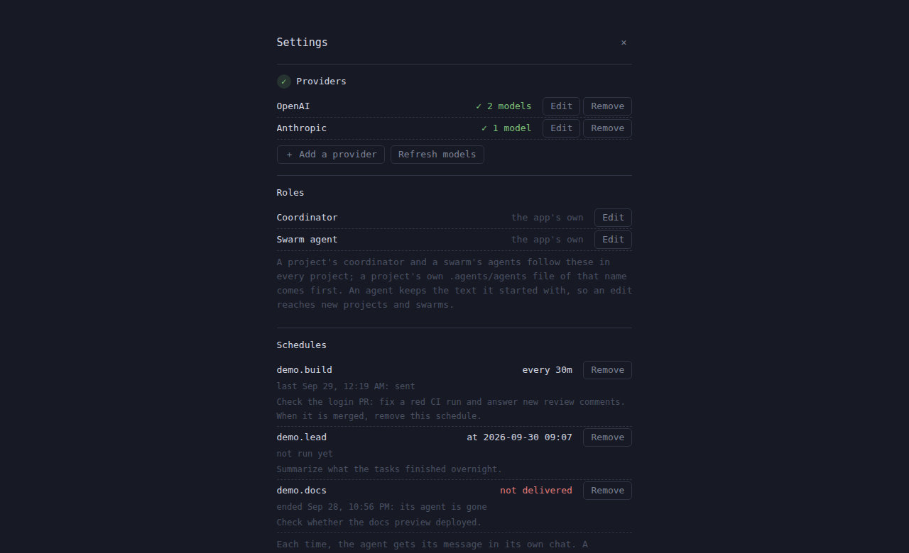

# Desktop client

`agent-app` is the Thread design as a window: the prototype's page, rendered by
the system webview, with a Rust core that speaks the daemon's socket protocol.
It exists because the design as drawn needs pixels, and a terminal's cell grid
cannot give it rounded cards, sub-cell spacing, or shadows. The daemon exposes
bounded history reads and creator identities; it does not
need to know which client is attached.

Started 2026-09-19. A terminal client (`agent-tui`, ratatui) came first the
same day and reached the limit of its grid; it was removed once the app
covered it, so one state model exists, not two.

## Screenshots

Demo mode in headless Chromium, 1280×780, captured 2026-09-28. The data is
the synthetic `demo` project.

The lead splits the work, build opens beside it, then build's ⋯ menu.


The lead waits on its tasks; each task is a card.


A task opened beside the lead, with its own composer.


One menu per agent: side chat, stop, fork, delete, show all.


The model chip: models under their provider; other families need a new agent.


Send on a busy agent: queue after this turn, steer into it, or ask a side
chat.


build works in its own worktree: its branch follows its name in the head.


A side chat asked while the lead works: a fork beside it, the lead untouched.


New project takes a folder and the model its lead starts on.


A first run opens setup: connect providers, then open a first project on a
model from any of them (demo `?first`).


Each provider asks for what it needs to sign in; Bedrock takes a region and an
AWS profile or a Bedrock API key, and serves Claude and its other models as
one provider.


Once a provider answers, the first project takes a folder and a model, listed
under its provider; nothing is chosen for you.


Settings (⚙ in the sidebar, or ⌘,) is the same screen. A provider that fails
says why beside those that answered.


Once a project exists, Settings also lists the app's two roles: the
coordinator's and a swarm agent's. **Edit** opens your own copy in
`~/.agents/agents/` in your text editor, made from the app's text the first
time, and from then on that file is the role in every project (a project's
own `.agents/agents` file of the same name still comes first). An agent keeps
the text it started with, so an edit reaches coordinators and swarm agents
made after it. Captured 2026-09-28.


A project's ⋯ menu starts a swarm: a goal, how many agents, where they work,
the tokens they share, what they are made of, and how they organize: one
board, or a council of three that approves streams of work. What they are
made of is a mix: rows of an identity (a plain agent, or a profile the
folder offers, such as a reviewer), a model from any connected provider, and
a share, each shown as the agents it makes at the size picked. Captured
2026-09-28.


The swarm's board: your goal first, then its agents' posts, the ones they
name marked, each under what its agent is when the swarm mixes kinds (here
three plain agents and a reviewer on another model). Its row in the sidebar
is working while any agent works.


Its agents as cards, each with what it is and its newest line.


Your post naming `@latency-3` woke that agent alone; clicking a name opens
the agent beside, with the board's posts it heard.


With a council, the board also carries roles, proposals, the seats' votes and
their decisions; a post in a stream wears its tag, which filters the board.


The Council tab: each open proposal with its votes so far, which you can
approve or deny yourself, then the ones decided.


Streams: the approved proposals, each with its lead and the agents in it.


You can also ask a project's coordinator for one ("start a swarm of six, two
of them reviewers, to halve the p99"). Its role tells it to run
`~/.agent/swarms/start`, a script the app writes, which starts the swarm the
way the sheet does; the swarm shows under the project once its agents take
their briefs.

A coordinator hears when you work in a task it started: once it rests, one
message lists the turns its tasks ended, and it passes on what another task
needs.


Agents can be woken at set times. Settings lists the schedules, what each one
last did, and the message it sends.



## What the daemon speaks, and why the client speaks it directly

The daemon's contract is JSONL over a Unix socket: requests with an `id`,
responses with the same `id`, and notifications without one, replayed and
then live under a store-wide cursor ([protocol](RUST_PROTOTYPE.md#software-protocol)).
The app, the `agent` CLI, and a fleet controller are the same kind of client.
Two alternatives were considered for the client path and rejected for now:

- **ACP between a client and the daemon.** ACP models one editor talking to one
  agent process over stdio. It has no vocabulary for named durable bots shared
  across clients, a store-wide event cursor, forks from history nodes, wait
  handles, delivery modes, or daemon stats; all of that would ride in extension
  fields. ACP remains the right shape for an editor adapter, as a bridge
  process that is a consumer like this app. It is not built.
- **A binary framing.** Per-event cost on the client path is the storage commit
  and the provider stream, not JSON encoding, and the socket carries no TLS or
  HTTP. A different framing would be a drop-in change behind the same op set
  if a measurement ever shows encoding on the follower path as a cost. None
  does; the JSON line protocol stays.

Remote use needs no transport work either: the protocol assumes nothing about
the stream, so `ssh -L` forwarding of the daemon's socket to a local one runs
the app locally at full speed against a daemon elsewhere. The client is built
to tolerate that latency anyway: one `follow *`, item loads pipelined per bot,
nothing polled.

## Shape

```
app/
  src-tauri/     Rust core: a transport, plus the project file
  ui/            the page: index.html, app.css, app.js, daemon.js
  playground.py  an offline daemon with a synthetic model, for mechanics
client/          agent-client: the socket protocol and the client policy
```

- **Rust core** ([app/src-tauri/src/main.rs](../app/src-tauri/src/main.rs)) is a
  transport. `setup` returns the socket, model and workspace defaults;
  `policy` composes the client policy for the workspace; `attach` connects
  and follows `*` from the page's cursor; `pull` hands the page the next
  batch of that session's notifications, at most 256, when it asks;
  `request` relays any protocol op; `models` reads `~/.agent/models`;
  `settings`, `save_settings`, `restart_daemon` and `discover_models` back
  [Setup](#setup-and-settings); and
  `project` and `write_project` read and write a folder's
  `.agents/project.toml` ([project.rs](../app/src-tauri/src/project.rs));
  `policy` composes a folder's client policy, in a profile when named, and
  falls back to the profiles the app ships for `coordinator`;
  `schedules` and `schedule_remove` list and remove
  [schedules](#schedules) ([schedule.rs](../app/src-tauri/src/schedule.rs)).
  When nothing listens on a store's socket, `attach` starts a daemon first
  ([daemon.rs](../app/src-tauri/src/daemon.rs)); see
  [Installing](#installing).
  State and protocol logic live in the
  page, exactly as they did in the prototype, so the design and the
  mechanics iterate in one place.
- **The page** is the prototype's HTML and CSS with the fake daemon swapped
  for events: bots and transcripts built from events, lineage from the
  daemon's `created_by`, cards for peers and background commands, thoughts
  folded to their duration, lazy item loads for whatever is on screen. Events,
  snapshot reconciliation, creation replies, and history loads share one
  mutation queue, so a pending read cannot splice over a newer snapshot.
- **Demo mode.** In a plain browser there is no Rust core, so `daemon.js`
  becomes a simulated daemon that emits the same protocol shapes and answers
  `history_items`, `submit`, `create`, `fork`, `delete`, `interrupt`. A steer joins
  the running turn at its next round boundary as a user message, and the
  scripted reply acknowledges it. The scenario
  plays on load in two projects: `demo.lead` thinks, starts a release build
  in the background, spawns its tasks plan, build and test, build spawns
  review, and the coordinator waits on all of it. A message to one of its
  tasks brings the coordinator a task update it answers. Serve `app/ui` with any
  static server to work on the design without a daemon.

## Installing

The app is published as a Homebrew cask for macOS (Apple silicon and Intel):

```sh
brew install --cask lydakis/agent/agent
```

The bundle carries the `agent` runtime as `Agent.app/Contents/MacOS/agent`,
and the cask links it onto `PATH` as `agent`, so the terminal's CLI is always
the app's own version. When the app finds no daemon on its
store's socket, it runs that binary as `agent start --store STORE`, which
starts the daemon exactly as a CLI command would: providers from
`AGENT_PROVIDER` or the keys that are set, the log beside the store, a
process that outlives the window. A window opened from the Dock inherits
launchd's environment rather than a terminal's, so `agent start` runs with
the environment of the user's login shell (`$SHELL -l -i`), plus
`~/.agent/env` for keys kept out of shell profiles: `KEY=VALUE` lines
(`export` and quotes allowed, `#` comments), refused unless it is a regular
file of at most 64 KiB that only its owner can read. That file is the app's; the CLI and the daemon never read it.
[Settings](#setup-and-settings) writes it.
The login shell is read once per app run. A value the file sets empty is
unset for the start, so Settings can clear what the shell exports. There is
no default model: a project or agent is given its own when it is made. The
store and socket themselves are resolved from the app's own arguments and
environment. A failed start shows the CLI's
reason on the page and is not retried for 30 seconds. An explicit `--socket`
or `AGENT_SOCKET` never starts anything. Uninstalling or upgrading the cask
quits the app and runs the bundled `agent shutdown --store
~/.agent/state.sqlite --grace 30`, so the default store's daemon, whoever
started it, lets running turns finish and exits before its binary is replaced.
The store is named so the uninstalling shell's `AGENT_STORE` or `AGENT_SOCKET`
cannot point the shutdown elsewhere.
A daemon that survived an upgrade anyway, and speaks an older protocol than
the app, leaves the window detached with **Restart the daemon**: the app
sends SIGTERM to the process that daemon named in its `ready` line (running
turns end as interrupted; the store keeps every chat), waits up to 30 seconds
for it to exit (an exited process nobody has reaped yet counts as gone), and
attaches, which starts the bundled daemon. Only a daemon whose `ready` greeting names
a protocol strictly older than the app's is signalled. Reattaching pauses
meanwhile, so nothing starts a daemon while the old one closes its store. A
daemon newer than the app is left alone: the page says to update the app and
stops trying to attach. A window given `--socket` or `AGENT_SOCKET` did not
start that daemon, so it offers no restart and says to stop the daemon with
its own agent and start one from this update's agent; it attaches when that
one answers. An exited daemon its parent has not reaped yet counts as gone,
on Linux from `/proc` and on macOS from `proc_pidinfo`.


Releases follow Errand's: pushing a `vX.Y.Z` tag on `main` whose version both
`Cargo.toml` and `app/src-tauri/Cargo.toml` carry runs
[release.yml](../.github/workflows/release.yml) on a macOS runner. The tag
itself only starts [release-request.yml](../.github/workflows/release-request.yml),
which holds no secrets; release.yml and publish-homebrew.yml run after it from
`main`'s own definitions, so code at a tag never sees the signing secrets or
the tap token. A failed run is re-run from its own page. It runs
the tests, installs the Tauri CLI from
[app/release/package-lock.json](../app/release/package-lock.json) before any
signing material exists, builds a universal `agent` and app, and has Tauri sign both with
the Developer ID and hardened runtime, notarize and staple the bundle
([tauri.release.conf.json](../app/src-tauri/tauri.release.conf.json)); it
then verifies the signature, Gatekeeper assessment, staple, architectures and
versions, and leaves `Agent_X.Y.Z_universal.zip`, the generated cask,
`source-commit.txt` (the commit it built) and `checksums.txt` on a draft
release. Publishing the draft (not a prerelease) runs
[publish-homebrew.yml](../.github/workflows/publish-homebrew.yml): it
resolves the tag to a commit on `main` before running any of its code,
refuses assets built from any other commit (a draft's tag can move) or
lacking release.yml's build attestation (a draft's assets can be replaced),
checks them against their checksums and the tag's cask generator,
installs and audits the cask, and writes `Casks/agent.rb` to
[lydakis/homebrew-agent](https://github.com/lydakis/homebrew-agent). It never
downgrades the tap or replaces a different cask of the same version. The
helpers and their tests are in [app/release](../app/release)
(`python3 -m unittest discover -s app/release`).

Secrets: the six Apple signing and notary secrets Errand uses
(`APPLE_DEVELOPER_ID_CERTIFICATE_P12_BASE64`,
`APPLE_DEVELOPER_ID_CERTIFICATE_PASSWORD`, `APPLE_DEVELOPER_ID_APPLICATION`,
`APP_STORE_CONNECT_API_KEY_P8`, `APP_STORE_CONNECT_KEY_ID`,
`APP_STORE_CONNECT_ISSUER_ID`), and `HOMEBREW_TAP_GITHUB_TOKEN` with Contents
write access to the tap.

## Running it

```sh
cargo build --release -p agent-app
.local/target/release/agent-app \
  --socket ~/.agent/state.sqlite.sock --workspace "$PWD"
```

Without `--workspace` the workspace is the launching directory, or home when
that is `/`, as for a window opened from the Dock. Arguments and environment
are the CLI's: `--socket`, `--store`, `--workspace`, `AGENT_SOCKET`,
`AGENT_STORE`, and a store's
socket is resolved the way the CLI and the daemon resolve it (the shared
client crate's rendezvous), so a deep store path meets the same short socket.
The page draws with the machine's own monospace face and fetches nothing.
Closing the window is detaching; the daemon and its bots continue. The page
remembers the thread on screen, the one beside it, the sidebar, folded
projects, model picks and the steps fold per socket and workspace in the
webview's local storage, and restores them on the next start. Send's queue or
steer pick is remembered for every window. If the daemon is unreachable or closes the session, the page shows why
and retries every two seconds. Only one attachment runs at a time, including
the snapshot pages. A connected peer must send its ready line within five seconds.

Keys: `^k` find a bot, `^b` sidebar, `^,` settings, `^p` next task beside, `^o` every
run's thoughts and output, `Esc` close the side pane then stop, `↑` `↓` on an
empty message to move between bots, `^d` close the window, Enter to send and
Shift-Enter for a new line, `/new NAME PROVIDER/MODEL` to create a bot, `?`
on an empty message for the list and the models in `~/.agent/models`, read
each time. `⌘` works where `^` does.

## Setup and settings

What a daemon needs before anything runs is the app's to ask for, not the
daemon's: it runs whatever providers it is started with and whatever model a
turn names. There is no default model (George, 2026-09-28): a project's lead,
and every agent, is given its model when it is made, from any provider
connected, and forks and side chats keep their source's. One screen covers a
first run and later changes:

1. **Providers.** Anthropic, OpenAI and OpenRouter take an API key; a ChatGPT
   plan uses the sign-in Codex saved; Amazon Bedrock takes a region and signs
   in one of two ways, chosen on the form: the AWS CLI's credentials for an
   optional profile (which drops a saved key), or a Bedrock API key. Bedrock serves Claude over Anthropic's API and
   its other models over OpenAI's, so the daemon runs it as two providers,
   `bedrock` and `bedrock-openai`; the app connects, lists and removes them
   as one. Connecting writes `AGENT_PROVIDER` (the providers already running
   kept, specs as `--provider` takes them) and the provider's fields to
   `~/.agent/env`, restarts the daemon with `agent shutdown`, which stops
   running turns and returns once the process is gone, attaches again, which
   starts a daemon with the new settings, and asks every provider for its
   models. Each row then shows its model count, or its refusal with a Retry.
   Connect and Remove read the file again first, so a change another window
   saved is kept.
   A key is never read back into the page: the core reports only which keys
   are set, and a key field left empty keeps the saved one; any other field
   left empty is saved empty, which clears the shell's value too (an AWS
   profile, say). Removing a provider drops its key unless another provider
   uses it; removing the last one also empties each key the shell exports,
   since a start with no provider named would otherwise detect one from it,
   and the window then waits for a provider instead of retrying. Removing
   rewrites no list; the pickers leave that provider's models out. A provider
   set up by hand under a known name (a gateway named `openai`, say) has no
   Edit, since the form would replace it with the provider's defaults.
   Refresh models asks again and writes the answer to `~/.agent/models`, replacing
   it: a provider that answers replaces its lines, one that fails keeps the
   lines it had, one no longer running loses them, and an answer with no
   usable model leaves the file as it was. A file that no longer reads is
   replaced whole. Pickers offer only the models of connected providers. A
   change that would make `~/.agent/env` larger than a start accepts
   (64 KiB) is refused.
2. **First project**, shown until one exists: a folder and a model, the
   models listed under their providers, then New project's path.

It opens on its own when a daemon cannot start for lack of a provider, and
once when a window first attaches to a store with no agents. An
`agent` the app did not bundle, or an explicit `--socket`, cannot be
restarted, so Settings saves no provider change there and says why; it
shows that daemon's providers instead of the ones this machine would start.

## Projects and panes

The shell follows the "Agent App Concepts" prototype (NEXT item 47). The
daemon learns nothing about projects; everything here is client work.

- **Projects.** A project is a folder, its coordinator bot `<project>.lead`,
  and `.agents/project.toml` (name, coordinator, model; mechanics only). The
  sidebar lists every coordinator in the store as a project, with its tasks
  under it: the coordinator's `created_by` lineage, plus any root bot named
  `<project>.<task>`. Bots in no project follow. A project row opens its
  coordinator; its chevron folds the tasks. **＋ New project** takes a
  folder and a model from `~/.agent/models` under its provider's name (the
  last one picked comes first), reads its `project.toml` (unknown keys are refused) or names the
  project after the folder, creates the coordinator there with the folder's
  own client policy, and then writes the file if there was none, so a model
  the daemon refuses is never saved. The file goes in through a temporary
  and a link, so it is never partial and never replaces one. An existing
  coordinator is opened if it works in that folder (and the file it lacks is
  written with its model); one in another folder is a name collision,
  reported and not opened.
- **Panes.** A sidebar row opens that thread alone. A task card opens its
  bot in a side pane with its own composer; ⤢ swaps it into full view, ✕ or
  `Esc` closes it.
- **Composer.** The model chip lists `~/.agent/models`, read on each open,
  each provider under its own heading.
  Models of any provider in the bot's family (known from the fleet's bot
  records) switch the next turns (sent as `submit`'s `model`); other
  families, and providers no record places, show disabled as "new agent",
  since a bot keeps its family. Send starts a turn on a bot at rest; on a
  working bot it queues, steers or asks a side chat, as picked last from
  its ▾. A steer names
  no model or workspace, so it joins the running turn, and it names that
  turn (`expected_turn`): if the turn ended meanwhile, the daemon refuses it
  as `stale_turn` and the message stays in the composer. A model pick is
  remembered for the bot's identity, not its name. Unsent text belongs to
  the bot it was typed for: a pane that shows another bot puts it away and
  brings back that bot's own, a closed side pane keeps it, and Enter sends
  it to the bot it was typed for even if the pane is already switching.
  Drafts live for the window's life and go with a deleted bot.
- **One menu per agent**, from the head's ⋯, a sidebar row's or card's ⋯ on
  hover, or a right-click: side chat, stop, fork (an exact copy of a bot at rest in its
  folder, next to it in the tree, opened beside), delete (confirmed), and every run's
  thoughts and output. An open menu follows its bot's status. A sidebar row
  is one line; its glyph and the pane head say what it waits on.
- **Runs.** Thinking, tool calls and their output between two messages fold
  to one line: the call in progress with its clock, or the tools used, and
  any failure. A click opens a run or unfolds one long output.
- **Side chats.** A side chat forks a bot, running or not, with no
  checkpoint, so the daemon copies it at its newest finished round; the
  source is untouched. The copy is named `NAME-side`, nests under its
  source, and opens beside. From the ⋯ menu it opens empty; from Send's
  side pick, the message is its first. It has its source's tools and works
  in its source's folder, so it can edit there while the source runs: it
  is the same agent asked something else at the same time (George,
  2026-09-27). The fork names no tool list and no folder.
- **Tasks in worktrees.** This is the app's opinion, not the CLI's or the
  daemon's. A coordinator the app creates is started in the `coordinator`
  profile: the folder's `.agents/agents/coordinator.md`, the user's, or the
  one the app ships ([coordinator.md](../app/agents/coordinator.md)), whose
  model and tools apply when the project names none. The shipped text
  says: a task that changes files, named with the
  project's prefix so projects do not collide, gets
  `git worktree add -b agent/NAME ~/.agent/worktrees/NAME HEAD`, the
  folder's `.agents/setup` run inside it, and `agent run --new --agents
  --workspace` (or `--profile ROLE` when a listed role fits) that worktree,
  in the project's subfolder of it; the task
  keeps that folder for later messages. The text also says the worktree
  starts at the last commit, that a failed setup, or a start that left no
  bot, removes the worktree and branch,
  and that without git every task works in the project folder. The daemon only runs a
  turn where the bot is, or where a message moves it. A bot in a
  linked worktree shows its branch after its name in the head, read once
  from the worktree's files when the head is first drawn.
- **Swarms.** Also the app's opinion; the daemon learns nothing new. A
  project's ⋯ menu has **New swarm**: a goal, any number of agents up to 64 (typed), a mix, where
  they work (one worktree they share, `~/.agent/worktrees/PROJECT.NAME` on
  `agent/PROJECT.NAME` with the folder's `.agents/setup` run in it, or the
  project folder), and a token budget typed in millions (0.1 to 1,000),
  split evenly among them, each agent's share shown beside it. A goal is
  at most 16 KiB. The swarm is named after the goal's longest telling word
  among its first six; a name a bot holds (or its agents' names), or whose
  folder, worktree or branch another swarm or store holds, is skipped for
  the next, `-2`, `-3` and so on. Setup gets ten minutes and the login
  shell's ordinary variables (PATH, HOME, USER, LOGNAME, SHELL, LANG, LC_*,
  TMPDIR, TERM) and no others, so no provider or cloud keys (as do the
  swarm's git commands, whose hooks run too; this process's own variables
  stand in only when there is no login shell); past its time
  its whole process group is killed, and its output is kept only to its
  last 64 KiB. A failed start removes a worktree and branch only when it
  made them, never the project folder. The mix is up to eight rows of an identity, a model and a
  share, the shares adding up to 100%. An identity is a profile in the
  folder's or the user's `.agents/agents` other than the app's own
  `coordinator` and `swarm`; picking one picks the model its profile names,
  when that model is connected. The agents are dealt one at a time, each
  to the row furthest below its share of the agents so far, so any prefix
  of them keeps the shares as well as whole agents can (the council's seats
  mix too), and the sheet shows each row's count, or that a row makes none
  at that size. Start, Add and Stop are one call each to the app's Rust
  side, which names the swarm, deals its agents, makes or stops everything
  and undoes a failed start, so the
  page only shows the outcome: a swarm whose files or instructions cannot
  be made, or none of whose agents can be created, is removed with its
  worktree and branch; an agent that could not be made or briefed beside
  others that were is reported by name.
  The swarm is a folder, `~/.agent/swarms/STORE/PROJECT.NAME/`, where
  STORE is the store identity the daemon announces when a window attaches,
  so a window sees only its store's swarms, whatever socket reaches it:
  `swarm.toml` (its project, goal, folder, budget, mix, members with each
  one's bot id and row of the mix, whether you stopped it, the highest
  number an agent of it was made under, and the bot ids of members that
  left; at most
  1 MiB, read only when every member has an id and a row, changed only
  under the board's lock, synced, and replaced whole; written last when
  a swarm is made, so a folder without it is not listed), `board.jsonl` (one
  line a post or act, appended under a lock and synced, your goal first;
  each line says how many agents it was `sent` to, so what a
  swarm's posts cost in deliveries can be read off its board; the line is
  written before the sends, and a send that failed is in the poster's answer), `state.json` (what the board adds up to: roles, open and approved
  proposals with their votes (at most 16 open at once, and an approved
  stream closes when nobody is in it any more), the last 16 denied ones, a
  count that numbers the next, who is in which stream; a decided proposal's
  vote reasons stay on the board only). A change to it commits with its lines: the new state
  is written beside it as `state.pending.json` with the board's length
  before and after the lines, the lines are appended and synced, and the
  file then replaces `state.json`; the next act under the lock, or the
  next read of the board, finishes a change whose lines are all on the board and otherwise cuts the board back
  to where it was and drops the change. Then scripts that run the app's own
  executable with `--swarm-post`: `post` and `role`, and with a council
  `propose`, `vote` and `join` (replaced whole when the app moves). Its agents
  are ordinary bots named `PROJECT.NAME-N`, each created with its row's
  model and its share of the budget, and started in the `swarm` profile
  (the folder's, the user's, or the one the app ships,
  [swarm.md](../app/agents/swarm.md)); an agent with an identity starts in
  that profile, with the `swarm` profile's text after its own and the
  identity's tools, which must include `shell` since the board's scripts
  run in it. Each joins the swarm once created, and then gets a first
  message naming it, the goal, the others with their identities, the board
  and its scripts (and, with a council, the seats). A card and a post show
  an agent's identity, and its model when the swarm has more than one. A post is written to the board, then
  steered into the agents it reaches over one daemon connection: an
  agent's post reaches the agents working now, strictly into their running
  turns (a turn that ended meanwhile is skipped; the post waits on the
  board), and wakes an idle agent only when it names it with `@NAME`; your
  post wakes every agent, or only the ones it names. A post holds the
  board's lock until its steers are sent, so Stop either refuses it or
  ends what it started. So agents talking
  never wake a swarm that went quiet. A post is at most 16 KiB and comes
  only from a member, named by its shell's `AGENT_BOT`, `AGENT_BOT_ID` and
  `AGENT_TURN`; the daemon records it as each steer's author. Every steer
  names its member's bot id, so a bot deleted and made again under a
  member's name is not a member: a post misses it, and the app keeps it in
  the sidebar and out of the swarm's cards and counts; a deleted agent
  leaves its swarm when the app sees it go, taking its share of the budget,
  its role, its stream, its votes on open proposals and the open proposals
  it made (the board keeps them all); its helpers still count in the
  swarm's tokens and Stop still ends them (`swarm.toml` keeps its bot id
  in `left` until a look at the daemon's list finds nothing it made). A new agent always takes a
  number no agent of the swarm had, so a name on the board is only ever
  one agent's. A swarm is one sidebar row
  under its project (⁂, working while any agent works); its agents are not
  in the sidebar. Its view has two tabs: **Board**, read from where the
  last read ended whenever one of its agents does something durable, and
  only while it is on screen (more than 256 KiB behind, it reads the
  board's last 256 KiB instead; lines and state are read together under a
  shared lock, so they always agree, and a budget check that adds a line
  reads it too); and **Agents**, their cards, which open
  beside. The head counts working agents and tokens used against the
  budget, its helpers' tokens included. Its composer posts to the board.
  Its ⋯ menu stops every agent and helper
  (agents first, then the helpers they made, looked for again until a look
  finds none it has not stopped and no agent given a turn meanwhile; every unfinished turn, queued ones first, of each member that is still
  the bot that joined; a name now held by another bot leaves instead; and
  the swarm refuses its agents' posts until your next one the board takes; that post
  resumes the swarm before it goes on the board, so a failure between leaves it
  running with nothing new rather than your post on a stopped board)
  or, unless it is stopped, adds one from the row furthest below its share, told to read the board first,
  whose share of tokens the swarm's budget grows by. New agents join and
  get their briefs under the board's lock, so a Stop from another window
  comes first and they are refused (and deleted), or waits and ends the
  turns their briefs started. An agent whose brief did not arrive is
  deleted with its share, the agents briefed with it hear that it left,
  and a start none of whose briefs arrived starts nothing. A swarm every
  agent left takes no new one (`swarm_empty`); start another. A swarm's budget is what the agents it made
  were given: a start where some could not be made has the budget of those
  that were. Any agent says what it is doing with
  `role ROLE`, shown on the board and on its card. A helper is a bot an
  agent made with the CLI (a fork of a peer to ask it something, or of
  itself for a subtask), named after its maker (`PROJECT.NAME-N.WHAT`) so
  it sorts in the swarm's range of the daemon's list; one made by a member
  or by another helper counts in the swarm's tokens and stops with it, and
  cannot post. The daemon forgets a deleted bot's tokens, so each act that
  reads its list keeps each helper's tokens in `state.json` (`helpers`), and
  a helper deleted since counts on (`gone`) with what that look saw it use;
  what it used after that look is not counted. Each act that reads the daemon's list, and a check the page
  asks for at most every five seconds a swarm as its agents finish turns,
  tells the working agents when the swarm passes 50%, 75% or 90% of its
  budget: a `budget` line on the board, each share once (`state.json`
  keeps the last), and in the answer of the act that passed it.
- **Swarms a coordinator starts.** The app writes `~/.agent/swarms/start`
  each time it opens, a script that runs the app's executable with
  `--swarm-start` and no window, as the board's scripts do. It takes
  `--agents N` (4), `--budget MILLIONS` (3), `--council 3`, `--in-project`
  (else one shared worktree) and any number of `--row MODEL,SHARE[,IDENTITY]`,
  then `-- GOAL`; without rows every agent is a plain agent on the
  coordinator's own model. It runs only in a coordinator's shell (its bot is
  `PROJECT.lead`, the id its shell names still that bot's), reaches the
  daemon that shell belongs to, starts the swarm in the coordinator's
  project and folder through the same Rust start as the sheet, and prints
  the swarm, its agents' names and its board's path. Without rows its
  agents get the model of the coordinator's current turn (`AGENT_MODEL`).
  The start runs in a process group of its own, so a shell that gives up
  on it (its timeout, or its turn ending) cannot cut it off between making
  a worktree and undoing it; the role asks for a ten-minute shell timeout.
  When the goal's name and eight more are all taken it makes nothing. The app's
  [coordinator.md](../app/agents/coordinator.md) says when and how to run
  it. A window learns of a swarm it did not start when an agent it does
  not know, named like an agent (`-N`), takes a turn: it reads the swarms
  again once for a burst of those, and at most once for each such name.
- **The roles as files.** Settings lists the app's `coordinator` and
  `swarm` roles and whether you have your own file for each. Edit writes
  `~/.agents/agents/NAME.md` from the app's text only when it is missing
  (whole beside it, then linked into place),
  then opens it with `open -t` (`xdg-open` elsewhere). The file is the
  user's profile of that name, read in every folder that has none of its
  own. A bot's instructions are fixed when it is made, so an edit applies
  to coordinators and swarm agents made afterwards.
- **Swarm councils.** The sheet's "Organized as" picks one board (every
  agent takes a piece) or a council of 3, which needs at least three
  agents; a start that made fewer than three deletes them (naming any it
  could not) and starts nothing. With a council, the seats are the swarm's
  first three agents; when a seat is deleted the next agent takes it, and
  only the votes of the seats as they are now count, still 2 of the
  council's 3 however many seats are filled. An agent proposes a stream of work with
  `propose STREAM WHY`, which wakes the other seats; a seat votes with
  `vote ID yes|no REASON`, once. A majority of the seats (2 of 3) approves or
  denies; an approved proposal opens its stream with the proposer as lead
  and in it, and wakes the proposer while the working agents hear it; a
  denied one wakes only the proposer. You decide any open proposal alone
  from the **Council** tab. `join STREAM` puts an agent in an approved
  stream (one at a time). An agent in a stream posts to that stream: the
  post carries its tag and reaches the stream's working agents and whoever
  it names; `post --all` reaches everyone. Your posts reach everyone. The
  head gains **Council**, with the open count, and **Streams**, the approved
  ones with their lead and agents and their roles; a tag filters the board.
- **Not built yet.** Keep, which turns a side chat into a task, removing a
  deleted task's worktree, deleting a swarm, and approvals are later steps
  of item 47.

`python3 app/playground.py` starts a daemon on a synthetic streaming model
and opens the app on it; prompt prefixes (`shell:`, `bg:`, `delegate:`,
`fanout:`, `slow:`, `hold:`, `limited:`, `md:`) drive tool calls, delegation,
waits and pacing with no provider. `--no-app` prints the attach command
instead.

## Coordinators hear from their tasks

Work goes on in the tasks a coordinator started, mostly by you working in
them directly, and the coordinator should hear about it. The page already
follows every bot, so it tells it; the daemon has no part in this beyond
recording who asked for each turn (`from` on `accepted` and `queued`).
A turn counts when it ends in a bot the project's `PROJECT.lead` created,
unless the coordinator asked for it itself (its `from` names the lead) or
the bot is the coordinator's own fork or side chat (`PROJECT.lead-…`). A
steer's turn is part of the turn it joined. Turns replayed on attach are
history, not news. The coordinator is told only while it rests, at most
once every ten minutes, in one message queued to it: `Task updates:`, then
one line per task with its latest ended turn's handle and status, and how
many turns ended before it since which handle. The handles are what its
`wait` tool reads a final reply by, so the message stays small however much
was said. The page keeps only that per task (first and latest turn, a
count), so a long coordinator turn or a failing daemon cannot grow it. One
message names at most 32 tasks; the rest wait for the next, and it says how
many. The
[coordinator role](../app/agents/coordinator.md) says what to do with it:
send another task only what it needs, with `agent run --detach --delivery
queue`, which it reads at its next turn without being interrupted, and
otherwise answer in one line. A message that fails is kept for the next
one; a deleted coordinator's is dropped. The window must be open for it.

## Schedules

A schedule wakes an agent at set times with a message: a new turn in its
own conversation, never a new agent. launchd keeps the time, so a schedule
fires with the app closed, and a time the Mac slept through fires once when
it wakes (`StartCalendarInterval` coalesces missed times; `StartInterval`
and cron skip them). The daemon has no clock for this.

The app writes `~/.agent/schedule` each time it opens, a script that runs its
executable with `--schedule`:

```sh
~/.agent/schedule add [--bot NAME] [--name NAME] (--every 30m | --in 45m | --at 'YYYY-MM-DD HH:MM' | --cron 'MIN HOUR DAY MONTH WEEKDAY') -- MESSAGE
~/.agent/schedule ls
~/.agent/schedule rm NAME
```

`add` defaults to the agent whose shell runs it (`AGENT_BOT`), reaches that
shell's daemon, and pins the schedule to the bot's id. `--every` counts from
now in minutes that divide an hour, hours that divide a day, or `1d`;
`--in` and `--at` are one-offs within a year, which remove themselves once
fired; `--cron` is read as cron reads it, a day or a weekday when both are
given, up to 1,024 calendar entries. A message is at most 16 KiB. A schedule
is named after its bot unless `--name` says otherwise, and one added under a
name in use replaces it.

Each is one LaunchAgent, `~/Library/LaunchAgents/me.lydakis.agent.schedule.NAME.plist`,
and that file is its only record: its program arguments carry the bot, its
id, the store and the socket of the shell it was made from (an agent's shell
has both), the one-off's time and the message. Replacing one unloads the old
job first and, if the new plist cannot be written or loaded, writes the old
one back and loads it; a removal launchd refuses keeps the plist, so it can
be retried. When it fires, the app's executable runs with `--schedule-fire`
and those arguments. It connects to the daemon, and when none answers and
the store is known, starts one for it on that socket as the app does, with
the login shell's environment and `~/.agent/env`. A repeating schedule
submits with `delivery: reject`: a bot that is working, or has work
waiting, skips that time rather than having it cut in or pile up. A one-off
submits with `delivery: queue`, so a working bot gets it after its turn. A
bot deleted since, or a new bot under its name, is not reached
(`bot_not_found`), and the schedule ends. A one-off's calendar entry has no
year, so a fire more than two minutes before its time does nothing. What
the fire did (`sent` with the turn, `skipped`, `gone` or `failed` with why)
is kept with the schedule's row in `~/.agent/schedules/NAME.json`, which
Settings shows beside each schedule with its message and a Remove button. A
one-off that delivered leaves nothing; one that ends without delivering
(its agent gone, the daemon unreachable) loses its plist but keeps that
file, so Settings and `ls` still list it, as not delivered and why, until
it is removed. Those files are written, synced, renamed and their folder
synced. When the
app starts from a new place, as after an update, it writes its path into
every schedule and loads it again. Only macOS has launchd; elsewhere `add`
refuses with `schedules_unsupported`.

## What it costs, and where the bounds are

The UI bounds payload buffering, history decoding, and rendered fleet rows:

- **Attach** replays events from the page's cursor, which on a first start is
  the beginning of the daemon's retained log. That log is bounded by the
  daemon's retention (each bot's `retain_turns`, `prune`), and a `pruned` notice marks
  the gap. Nothing is staged on the way: the page pulls the replay a batch
  at a time and applies each before the next, so the transport's 4,096-event / 8 MiB encoded
  queue is the buffer between the daemon and the screen, and pulls also stop at 1 MiB (plus one event). A page
  slower than the fleet is told it lagged and attaches again from its
  cursor. The snapshot is paged (256 bots a request) while the replay flows;
  a bot the replay already spoke of keeps the state those events built and
  takes only the record's static fields, a bot an event names before its
  record arrives gets a seat at once, and a listed bot nothing mentioned is
  seated from its record. Session tombstones keep late snapshot pages from
  restoring a deleted identity; touched identities take precedence over stale records.
- **Transcripts** keep at most 1,200 decoded entries and an 8 MiB serialized JSON budget
  (measured as UTF-16 strings) around the reader's window (up to 400 entries of count hysteresis).
  Eviction folds whole durable nodes, tool rows and process cards into ranges
  with only endpoint IDs, rather than retaining an object for every old node.
  Scrolling loads at most 400 references in either direction, including a fork's
  inherited history after its source is deleted. Snapshot heads seed older
  lineage even when activity events were pruned. Overlapping ranges are unioned,
  so one node cannot be decoded twice around interleaved peer cards. Bodies are
  fetched with `history_items`: one ancestry validation per requested batch,
  a 768 KiB reply target, and at most one larger item within the frame limit.
  An item exceeding the transport limit returns an item-specific error, while
  the rest of the batch stays readable. Turn identities survive pagination.
  Completed process results keep their
  ordinary output row, including stdout and stderr; cards show only a summary.
  Event-only activity notes outside the window collapse to an explicit count.
  Thinking yields to answer text as soon as answer deltas arrive, and partial
  streams are discarded at turn end unless a durable message was committed. Counters for
  thoughts, long outputs and peers are updated with the items. Peer cards compact
  from 601 to the newest 300 with a count of earlier peers; older bots remain
  reachable through the switcher. Both creation and fork events insert creator
  peer cards, and deletion removes them.
- **Rendering** rebuilds the window's HTML only on a structural change (a
  load, a fold, another bot). Items appended since the last render are added
  on their own; a tool finishing or a process ending replaces its own line; a
  streamed delta appends plain text to the tail; Markdown is parsed once the
  durable message arrives; the once-a-second clock refreshes the
  elapsed spans and peer cards in place. The rail shows a window of 300 rows
  around the selection, extended by scrolling to an edge; its tree is rebuilt
  when the fleet's shape changes (a bot created, forked or deleted) and a
  status change replaces that bot's own row. The picker shows at most 200
  rows, and the activity check behind the clock is cached per fleet change.
- **Creation** costs no request: the `created` and `forked` events carry the
  record's list fields, so a burst of ten thousand bots is ten thousand
  events, not ten thousand `resume` round trips. An event missing its provider
  field is a protocol error, with no legacy `resume` fallback. Lineage is the store's
  `created_by_id`: a bot links under its creator only while the bot holding
  that name is the identity that created it.
- **Sessions** count up; an event from an older session is dropped, a
  submission waits for a known bot id and carries that identity. A bot that
  reappears under a known name with a new id starts from nothing. A lagged stream (the core's
  event count or 8 MiB byte budget filled) closes the transport, fails every request made
  after that at once, and the page attaches again from its cursor, from
  outside the event chain so the attach cannot wait on itself. A new attach
  lets the previous session's socket go first, so a pull still waiting on it
  comes back closed rather than holding the new session up. A borrowed event
  receiver retains its session owner and cannot be returned to a replacement
  attachment, even while that attachment has its own pull pending. Canceled
  requests release their pending registration immediately. Cancellation during
  a partial socket write closes the session before another request can write.

## Verified

2026-09-19. Demo mode in a browser: the scenario renders as the concept
(cards with elapsed at the right edge, thought fold, wait line), `^p` opens a
peek with the peer's tool calls and final text, `^b` shows the tree main →
plan, build → review, test, and `^k` filters to "review ↳ build". Live mode:
the built app attached to a playground daemon: asked over its socket, the
daemon reported the app's session while the window was up and none after it
closed, and the page forwarded no errors. That needed
`src-tauri/capabilities/default.json` granting `core:default`; without it the
page cannot subscribe to window events and never attaches. Page errors are
forwarded to the app's stderr through a `log` command.

Not verified: the live window's rendering by eye (the debug binary is not a
bundle, so it could not be screenshotted here) and a real provider.

The tree uses the daemon's `created_by` (bots created from a shell tool since
schema 22, with the creator's identity since 23) or the `created` event; a bot
without a creator, or whose creator's name has since changed hands, is a root.

`/new` gives a bot the shared client policy ([CLIENT.md](CLIENT.md)); the
create notice says what went in. An oversized or unreadable AGENTS.md or skill
refuses the creation with the CLI's `--agents` error rather than creating the
bot without it. It also supplies the same default compaction
instructions as the CLI, so app-created bots can summarize older context.
Completed thoughts retain locally observed thinking time; historical thoughts
without a recorded duration show no invented time.

On 2026-09-28 a swarm was started from the sheet in demo mode in headless
Chromium: its agents posted, a post naming one woke it alone, and an agent
opened beside from the board, with no page errors. The post tool itself runs
against a real daemon in `tests/test_swarm.py`: an agent's post reaches the
agent working, wakes the idle one it names and no other, and is refused for a
bot that is not a member or while the swarm is stopped. A council swarm's
proposal wakes its three seats, a second yes opens the stream and wakes the
proposer, a non-seat's vote is refused, and a post from a stream carries its
tag and reaches nobody outside it (same test file), and each post's line
records how many agents it was sent to. A coordinator's `start` runs from its
shell against a real daemon there too: two agents on its model in its folder
with half the budget each, briefed, the board in that store's swarms, and
the script refused from a bot that is not a coordinator. Start, Add and Stop are tested in
`app/src-tauri/src/swarm.rs` against a stand-in daemon: each agent gets its
row's model, identity and share of the budget, one that fails is reported
while the rest start, a start with no agent leaves nothing behind, an
identity without `shell` is refused before any agent exists, Add skips a
name another bot holds, and Stop ends unfinished turns newest first,
its helpers' and their helpers' too, one made after its first look
included, but not a bot no agent made, and
lets a reused name leave; the board says 50% and then, past 90% at once,
only 90%, each once, counting a helper's tokens. The council was also
driven in demo mode: roles, two proposals, one approved by the seats, a
stream two more agents joined, and the other left open for you.

On 2026-09-27 the shell was driven in demo mode in headless Chromium:
projects and tasks in the sidebar, a card opened beside and swapped, the three
menus, fork, confirmed delete, folding and a new project, with no page errors.
A task's runs rendered while it worked matched a full redraw of the same pane.

On 2026-09-29 (Linux container) a schedule's fire ran against a real daemon
in `tests/test_schedule.py`: it sent its message to its resting bot as a new
turn, skipped the bot while a turn held it, gave a one-off to a working bot
after its turn, started a stopped daemon on the socket the schedule was made
with, ended with a visible row when its bot was made again under the same
name, and did nothing a year early; `add` from an agent's shell was refused
without launchd and left no plist. The plist, calendar expansion, replace
(and restoring the old one when launchd refuses the new), remove (kept when
launchd refuses the unload), ended rows and the app's move are tested in
`app/src-tauri/src/schedule.rs` with launchd stood in for. The coordinator's
task updates are tested in `app/tests/state.test.cjs` and were driven in demo
mode in headless Chromium. Not verified: launchd itself, which needs a Mac.

## Next

1. Run it against a real daemon and model by eye; fix what the screenshot
   shows.
2. Refuse a `~/.agent/env` that a macOS ACL makes readable by other
   accounts; today only its POSIX mode is checked.
3. Stop a daemon the app started for a store other than `~/.agent`'s when
   the cask is uninstalled; the uninstall hook stops only the default one.
4. The rest of the projects design (the "Agent App Concepts" prototype), in
   the order [NEXT item 47](NEXT.md) gives.

## Regression checks

Run `node --test app/tests/state.test.cjs` for malformed tool arguments,
reconnect serialization, historical process results across batches, whole-node
eviction, a 10,000-peer fan-out, incremental text/thinking rendering, tool-row
windowing, CSS control-character escaping, creation-event validation, concurrent
submission IDs, fork-history paging, snapshot/history ordering, history paging
past activity summaries, pinned submission identities, oversized-item isolation,
compaction policy propagation, creation refusal when the workspace policy
cannot compose, completed thought timing, and the shell: projects from
coordinators and lineage, folding, opening alone or beside and swapping,
per-pane sends with the sticky queue or steer pick, model choices within a
provider, the agent menu's enabled items and its refresh on a status change,
fork naming and placement, side chats (a running source, the allowed list,
the first message going to the copy), a worktree bot's branch in its head,
project creation (no file for a refused model),
steers pinned to their turn, model picks pinned to identity, the demo
daemon's steer delivery, runs folded with failures on their line, and a
coordinator's task updates (one batched message when it rests, never for
turns it asked for or replayed ones, kept when a send fails).
`cargo test -p agent-app` includes a failed project-file write leaving
neither a partial file nor a temporary, and schedules' calendars, plists,
replace, remove and move. With `AGENT_TEST_RUNTIME=1` after a release build
and `cargo build -p agent-app`, `python3 -m unittest tests.test_schedule`
fires schedules against a real daemon.
`cargo test --workspace` includes the silent-listener readiness deadline,
fork workspace parity between durable records, live events, and replay, and
the app's policy errors for oversized and unreadable AGENTS.md files.

A synthetic local debug-build probe with a 100,000-node in-memory history read
the same 400 older items in three matched runs: individual ancestry checks took
33.8–34.1 seconds; `history_items` took 87–88 ms. The returned items were identical.
This measures the ancestry-walk reduction, not an end-to-end fleet capacity claim.

Pulled event batches apply in order, with one visible-history load and render
per batch. Creation/fork bursts rebuild the fleet tree at most once per pull,
while retaining the 300-row rail window. The shared client rejects a ready
handshake unless its protocol is exactly `agent_client::PROTOCOL`, now 4.

The lifecycle regression suite compares committed thinking/answer transcripts
between live delivery and replay, reconciles fork snapshot/replay ordering,
and rejects late process/history replies from a replaced session or bot.
Disconnect drops non-durable stream buffers; committed nodes remain the source
of transcript content.

On reconnect, an advanced snapshot head invalidates the older decoded history
cache and reseeds it from durable lineage. This recovers messages whose activity
events were pruned while disconnected; newer replay nodes and ranges are kept.
The rail slides a fixed 300-row window in either direction and anchors an
overlapping row to preserve scroll position. Only selection or fleet-shape
changes recenter it.

Snapshot lineage also restores peer cards after creation events are pruned,
including children listed before their parents. Anthropic content blocks keep
their stored order in both live and replayed transcripts. Ready submissions
retain their turn ID so Escape can cancel work waiting for a runtime slot.
