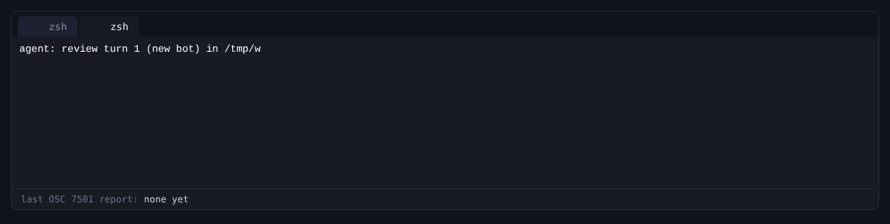

# CLI contract

Agent uses flat verbs: `run`, `follow`, `fork`, `interrupt`, `wait`, `ls`,
`turns`, `rm`, `prune`, `approvals`, `answer`, `models`, `start`, `stats`,
`shutdown`, and `serve`. All named
bots use the same commands. There is no parent/child command hierarchy.

Use `agent --help`, `agent COMMAND --help`, or `agent help COMMAND` for help;
`-h` also works. Help writes to stdout and exits successfully without opening
a store or connecting to a daemon.

Inside a bot's shell tool, `AGENT_BOT` and `AGENT_BOT_ID` identify that bot.
The client sends both as `created_by` and `created_by_id` when creating or
forking a child. The store rejects missing or stale creator identities before
creating the child, including after a daemon restart or name reuse;
`AGENT_PARENT` and `AGENT_PARENT_ID` identify the running bot's recorded creator
when its identity was known at creation. Address that creator with
`run --detach --bot "$AGENT_PARENT" --bot-id "$AGENT_PARENT_ID" -- TASK`.
The ID stays pinned after deletion, so a replacement with the same name rejects
the call instead of receiving the work.
`run` without `--bot` creates a fresh identity. `run --bot NAME` continues an
existing bot; add `--new` to create that name. A prompt of `-` reads stdin.
`follow --bot NAME` replays and follows the selected current turn to its end;
an idle bot returns after replay. `follow --all` stays connected for future work.

## Arguments and flags

- Put the command first. Options may appear before or after its operands.
- Long value flags accept both `--flag VALUE` and `--flag=VALUE`.
- `--` ends option parsing. For example, `agent run -- --help` sends the
  literal prompt `--help`. Use `--instructions=--example` for a flag-like value.
- Prompts and wait handles are positional operands. Every bot selector is
  `--bot NAME`; a fork uses `--source NAME` and `--bot DESTINATION`.
- `--all` selects all bots for `follow`; `--any` selects first-completion
  behavior for `wait`. `follow --all --bot NAME` is an error.
- `run --delivery MODE` is `reject`, `queue`, or `steer`: what the
  submission does when the bot is busy. Without the flag, `AGENT_DELIVERY`
  applies, then `reject`. `--turn N` with `steer` makes it strict: for that
  running turn or `stale_turn`. The daemon has no default of its own: the client
  always sends the mode it resolved, so one person's preference never
  changes what a program's submission means. A blocking `run` with `queue`
  follows the turn from its queued state to its end; with `steer` it ends
  with exit 0 when the message is absorbed (`steered`, naming the turn it
  joined) or when the turn it started completes.
  A steer with an explicit workspace or model that differs from the running
  turn stays queued and runs separately with those choices.
- `run --workspace DIR` chooses the folder. A new bot starts in it, or in
  the directory `run` was invoked from. A bot keeps its folder: a later
  `run` without the flag runs there wherever it is invoked, and one with it
  runs in `DIR` and moves the bot there; a steer's folder never moves it.
  A `fork` starts in its source's folder unless it names one.
- Unknown flags, flags belonging to another command, unexpected operands,
  and repeated singleton flags are usage errors. `--provider` is repeatable.
- `--instructions` and `--instructions-file` are mutually exclusive.
  `--agents` composes the shared client policy instead: the harness preamble,
  every AGENTS.md from the workspace up to the root plus `~/.agents/AGENTS.md`,
  and indexes of the skills in `.agents/skills/NAME/SKILL.md` and the
  profiles in `.agents/agents/ROLE.md` ([CLIENT.md](CLIENT.md)). It is
  opt-in on the CLI, the default in the app, and exclusive with
  `--instructions`. `--profile ROLE` composes the same text with that role
  last, and takes the role's `model` and `tools` unless `--model` or
  `--tools` names them; a missing role is `profile_not_found`. `fork` takes
  none of these: a fork is an exact copy of its source, instructions
  included.
  With `run`, instructions and token budget apply to new identities;
  passing them while continuing an existing named bot is an error.
- `run --new --approval MODE` and `fork --approval MODE` choose whether a
  new bot's tool calls wait for a verdict: `full` runs every allowed call (no
  gate), `manual` waits for an answer from any client, and `auto` has a
  judge model decide each call. For `auto`, and whenever `run` continues or
  `fork` copies a bot an `auto` gate answers, the CLI starts `agent
  approver` detached when no session serves the `auto` tag, and gives a
  call 45 s before its gate lapses.
  Without the flag, `AGENT_APPROVAL` applies, then `full`. `--approve LIST`
  picks the gated tools and must name at least one; the default is every
  tool but `history`, `wait`, `note`, and `echo`. A fork keeps its source's gates and a created bot its
  creator's ([APPROVALS.md](APPROVALS.md)).
- `approver [--tag TAG] [--judge PROVIDER/MODEL] [--reasoning LEVEL]
  [--note FILE] [--judge-url URL]` serves a gate tag (default `auto`) and
  has a judge decide every call waiting on it, one request per round,
  printing one JSON line per round. The judge is `--judge`, else
  `AGENT_APPROVER_JUDGE`, else `typesafe/jev-latest` when `TYPESAFE_API_KEY`
  is set, else `AGENT_MODEL`; any model but Jev (`typesafe/jev-*`) runs
  through the daemon, with
  a tag of at most 87 bytes, and `--reasoning` sets its effort. `--note` (default `AGENT_APPROVER_NOTE`)
  is a regular file of at most 96,000 bytes the judge always sees, such as
  trusted remotes and hosts ([APPROVALS.md](APPROVALS.md#automatic-mode)).
- `approvals [--bot NAME] [--tag TAG]` lists the calls waiting on a gate.
  With `--pretty`, each call shows what it would do (every line of its
  command, or of what a `write` or `edit` puts in its file, terminal
  controls escaped) and, for each gate still
  open, two whole commands, one that allows and one that denies, so a
  pasted line never carries a verdict its reader did not pick. The call id
  is written `--call=ID`, so an id that starts with `--` stays the value. `answer --bot NAME --turn TURN --call ID --request N
  [--tag TAG] [--reason TEXT] allow|deny` records one gate's verdict; `--tag`
  may be left out when the call has one gate, and a denial's `--reason` is
  what the model sees (an allow takes none). `answer` refuses to run inside a bot's own tool shell
  (`answer_in_tool_shell`). `run --pretty` and `follow --pretty` print the
  same commands when a call waits. A printed command carries `--store` or
  `--socket`, as absolute paths, whenever the daemon it came from is not
  the default one, so it answers that daemon from any shell.
- Time units are explicit: `--timeout-ms` is milliseconds; `--idle-exit`,
  `--stall-timeout`, and `--keep-warm` are seconds. `--after` is an exclusive event cursor for `follow` and an exclusive
  turn ID for `turns`. `--checkpoint` is a history node ID.
  `--approval-hold-ms` is milliseconds: how long a new bot's gated calls
  wait live for a verdict before the turn parks (default 2,000; 0 parks at once).
- `run` sets a new bot's own settings with `--context-bytes`, `--context-items`,
  `--note-turns`, `--compact-at`, `--compact-keep`, `--retain-turns`,
  `--approval-hold-ms`, `--max-output-tokens`, `--keep-warm`, and
  `--cache-ttl`; they are not daemon options, and an existing bot
  keeps its own (see [bot settings](RUST_PROTOTYPE.md#bot-settings)).

The lightweight command registry in `src/cli.rs` supplies help and option scope
for both client commands and `serve`. Keep that registry, the implementation,
and behavior tests aligned when adding an option. No CLI framework or runtime
dependency is required.

## Output and status

Default output is machine-readable JSON. `run` and `follow` stream one JSON
object per line. Snapshot commands return compact JSON objects; `ls` and `turns`
return arrays. `interrupt` and `shutdown` return no stdout on success.
`shutdown` returns once the daemon process has exited and its store is closed.
`shutdown --grace SECONDS` first lets running turns finish for up to that long
while starting none; turns still running then end `interrupted` with
`daemon_shutdown`. A daemon whose ready line announces an older protocol than
this `agent`'s cannot be asked in this protocol, so `shutdown` sends SIGTERM to
the process that ready line names (a process already gone counts as stopped)
and waits for it the same way: its running
turns end interrupted and the store keeps every chat. That is how an upgrade on
a machine replaces the daemon an older `agent` started. A newer daemon is left
running and `shutdown` fails with `daemon_protocol_mismatch`.

`--pretty` is an explicit human view: rendered streams, tables for lists, and
indented JSON for other results, including detached submission handles. It is
rejected on commands with no output. Diagnostics go to stderr. Rendered model
text and tool output keep their line breaks and tabs; any other character a
terminal would act on is printed escaped, so a stream cannot hide or restyle a
call waiting for approval.

On a terminal, `run --pretty` and `follow --pretty` also report program status
([OSC 7501](https://www.superlogical.com/rex/docs/build/program-status)), so a
terminal that supports it can mark the tab: `working` while the turn runs,
`blocked` (`kind=permission`) while a call waits for approval, then `done`,
`error`, or `idle` when the turn completes, fails, or is interrupted. `follow
--all --pretty` reports one record per bot, with the bot's name as its id, and
clears a deleted bot's record; history replayed before the stream goes live
reports only turns still running. Each report has `app=agent` and the bot's
name as its title, and is written once per change. Nothing is written when
stdout is not a terminal.

The recording is `run --pretty` against the offline playground, replayed in
xterm.js with a small OSC 7501 handler that draws the tab's mark.

| Exit | Meaning |
| --- | --- |
| 0 | Requested operation succeeded, including help/version |
| 1 | Operation failed, requested result is incomplete, or wait timed out |
| 2 | Invalid command-line usage |
| 75 | `serve` could not acquire store/socket ownership |

`wait` normally requires all handles to resolve without errors. With `--any`,
one resolved successful handle suffices and the remaining handles stay valid.
An errored first result or a timeout with no resolved result exits 1.
`--timeout-ms 0` polls once and prints the same JSON result with unresolved
handles marked pending. Completed successful handles can still return exit 0.

## Connection and startup

Every client command accepts `--store` and `--socket`. Client store selection is explicit
`--store`, then `AGENT_STORE`, then `~/.agent/state.sqlite`. Explicit `--socket`
wins; otherwise `AGENT_SOCKET` applies unless `--store` was explicit. Without a
socket override, the socket is derived from the selected store.

`run` may start the daemon. `start` starts it if none is running, with the
same startup as `run`, and prints the running daemon's ready line with
`socket`, the absolute path it answered on, added; a caller that ran `start` over SSH
forwards that path. A socket path that is not UTF-8, which the ready line
cannot carry, is refused before anything starts (`socket_path_unsupported`). When the daemon holding the socket speaks another
protocol, `start` still prints its ready line and then fails with
`daemon_protocol_mismatch`, so a caller can tell an older daemon from a newer
one. `stats`,
`turns`, `rm`, `prune`, `approvals`, and `answer` may restart it only for an
existing store. These commands accept the startup
provider/limit flags shown in help and `--no-spawn` to require an
already running daemon. Startup flags configure a newly started daemon. A
running daemon is never reconfigured: a stated startup flag it does not match
fails the command with `daemon_configuration_mismatch` naming the difference.
Comparison uses effective limits: `--idle-exit 0` means disabled, and positive
context limits are clamped to at least 1,024 bytes and two items.
With no `--provider`, a started daemon takes `AGENT_PROVIDER` (the same specs,
separated by whitespace), else the providers whose key variable is set; a
running daemon is not checked against either.
`run --model` names a new bot's model or an existing bot's turn model; the
daemon has no model of its own, so a new bot needs `--model` or `AGENT_MODEL`.
`AGENT_MODEL` is only a creation default. An existing bot uses its stored
model unless `--model` explicitly overrides it for this turn.
`run --reasoning LEVEL` sets a new bot's effort: `low`,
`medium`, `high` or `xhigh` on either family, and `max` on Anthropic's; any
other is refused with `invalid_reasoning_level`. Without it the request carries
no level and the model uses its own default. On an existing bot it sets this
turn's effort, as `--model` sets its model, and the bot's own is unchanged. A
turn with a level sees it in its shell as `AGENT_REASONING`, and a new bot that takes its model
from `AGENT_MODEL` takes its level from `AGENT_REASONING`, so a peer started
on its creator's model thinks as hard as its creator; a bot given
`--model` or a profile's model gets only its own `--reasoning`.
`run --instructions` and `--instructions-file` set a new bot's instructions,
with the CLI's built-in text as the default; the daemon has none. `run
--tools LIST` chooses a new bot's tools from those the daemon registers,
default `shell,read,write,edit,wait,history`; an existing bot keeps its own,
so `--tools` while continuing one is a usage error.
Other client commands require an already running daemon.

`models` prints `~/.agent/models`, the models clients offer, as JSON
`[{id, note?}]` (`--pretty`: one line each). The file holds one
`PROVIDER/MODEL` per line, with anything after `#` a note; no file is an
empty list, and a malformed line fails with `models_invalid` naming it.
Reading it needs no daemon, and the daemon never reads it: any model runs.
`models --discover` writes a first file from the listings of the providers
the daemon runs (starting one like `run`), with each model's name and
context size as its note and a comment for a provider that listed nothing.
When no usable model survives rendering within the file limit, it writes
nothing and fails with
`models_none_listed`, naming each refusal, so it can run again after a
login. It refuses with `models_file_exists` once the file exists: after
that it is the user's to edit. Bots see the same list by running `models`.

`serve` requires explicit `--store` and `--provider` options. It runs the daemon
directly, with Unix-socket service when `--socket` is
provided and the stdio protocol otherwise. Credentials and provider configuration
follow the [runtime documentation](RUST_PROTOTYPE.md).
